# 3D Printing Instructions

## Files

Please refer to the Releases page for the latest release of CAD model and 3D printing project files.


[Releases](/docs/releases.md)


## Print settings

The following parameters are tuned for the Bambu Lab X1C 3D Printer. Additional modifications might be required to fit your own printer's characteristics.

## Printing the actuator

### Actuator Housing Profile

For the housing, output shaft, and the motor shell, the Actuator Housing Profile should be used.

<figure>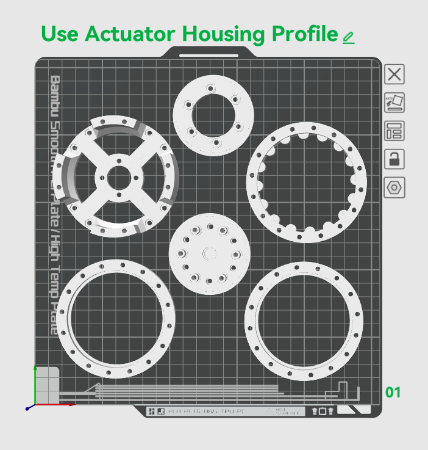<figcaption></figcaption></figure>




<figure>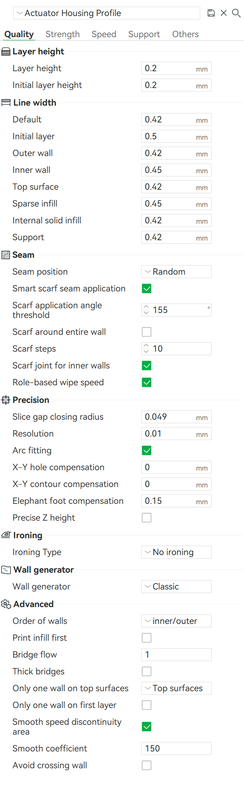<figcaption></figcaption></figure>




<figure>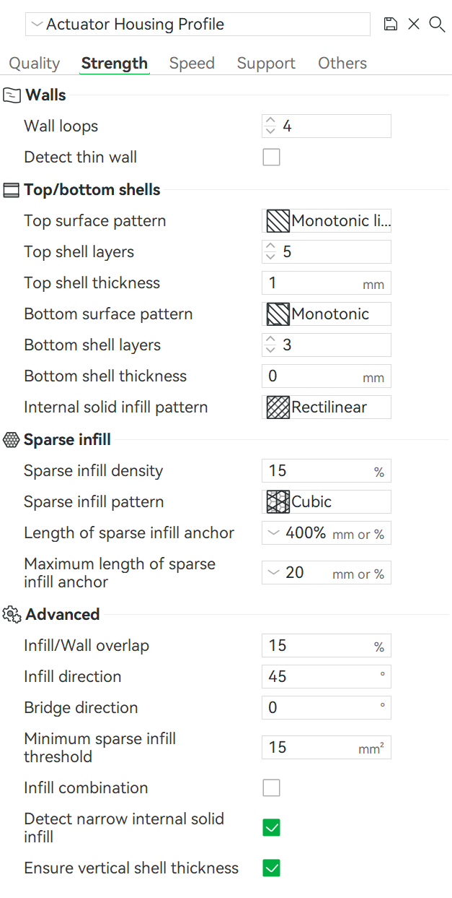<figcaption></figcaption></figure>




<figure>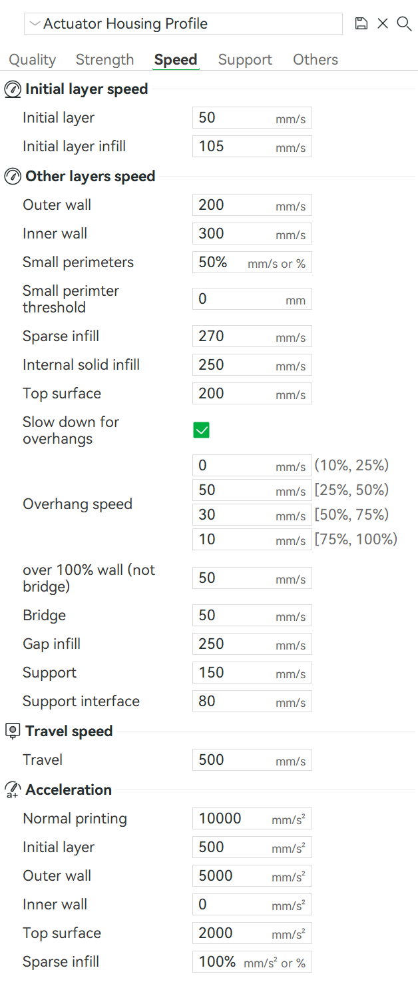<figcaption></figcaption></figure>




<figure>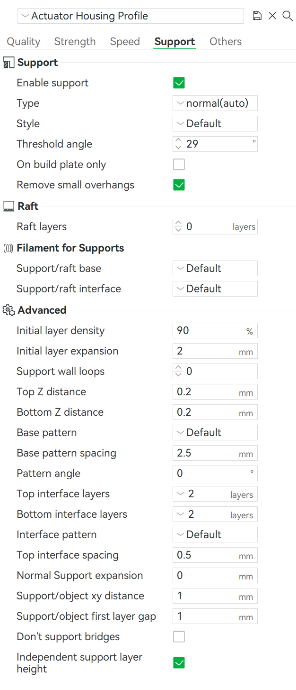<figcaption></figcaption></figure>




<figure>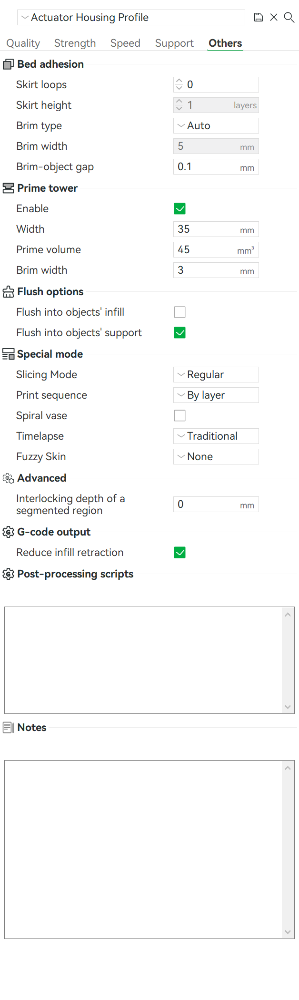<figcaption></figcaption></figure>



### Actuator Shaft Profile

For the cycloidal disk, input shaft, motor shaft, and the spacers, the Actuator Shaft Profile should be used.

<figure>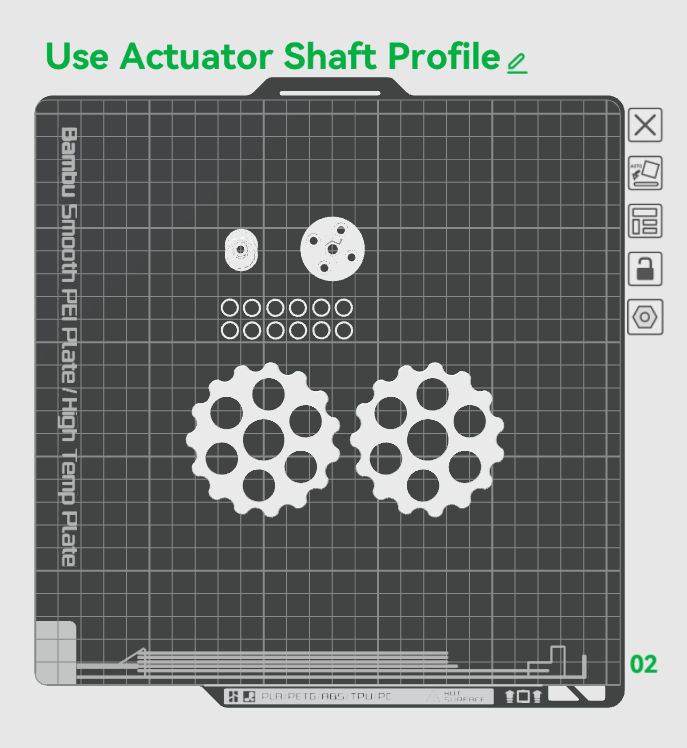<figcaption></figcaption></figure>




<figure>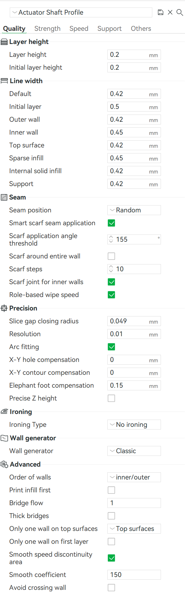<figcaption></figcaption></figure>




<figure>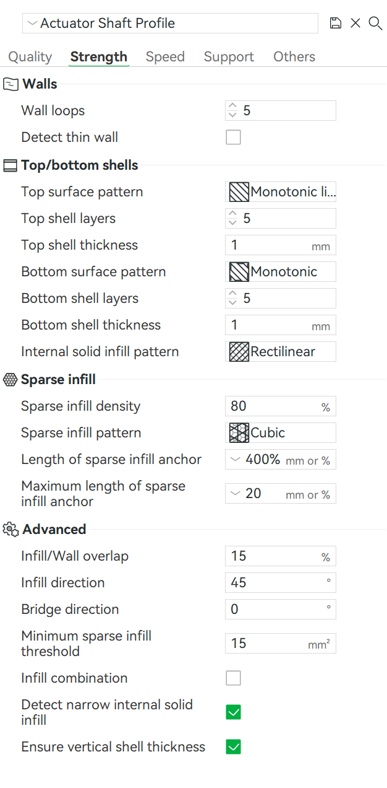<figcaption></figcaption></figure>




<figure>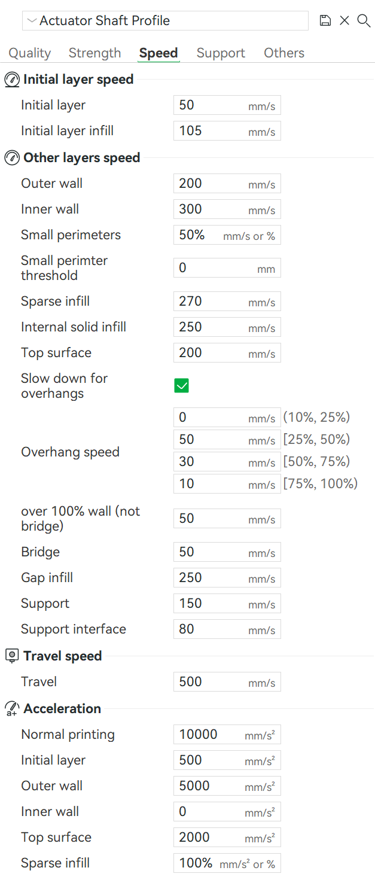<figcaption></figcaption></figure>




<figure>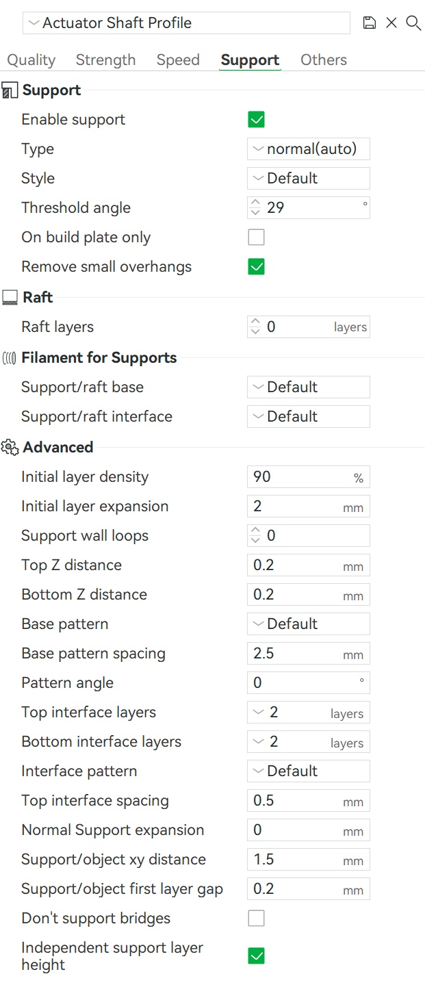<figcaption></figcaption></figure>




<figure>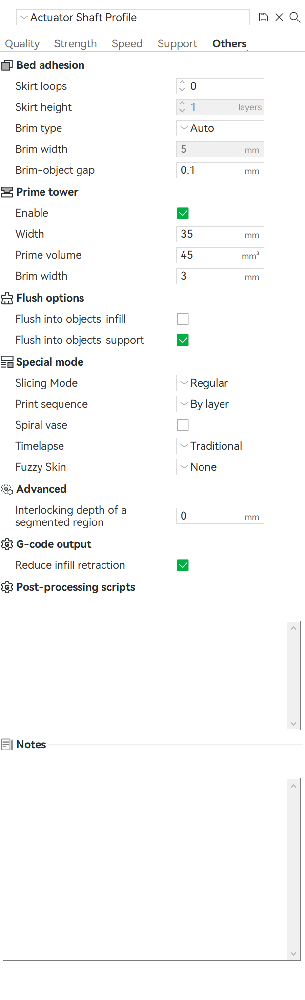<figcaption></figcaption></figure>



## Printing the rest of the robot

Similar principle applies to the rest of the robot.&#x20;

<figure>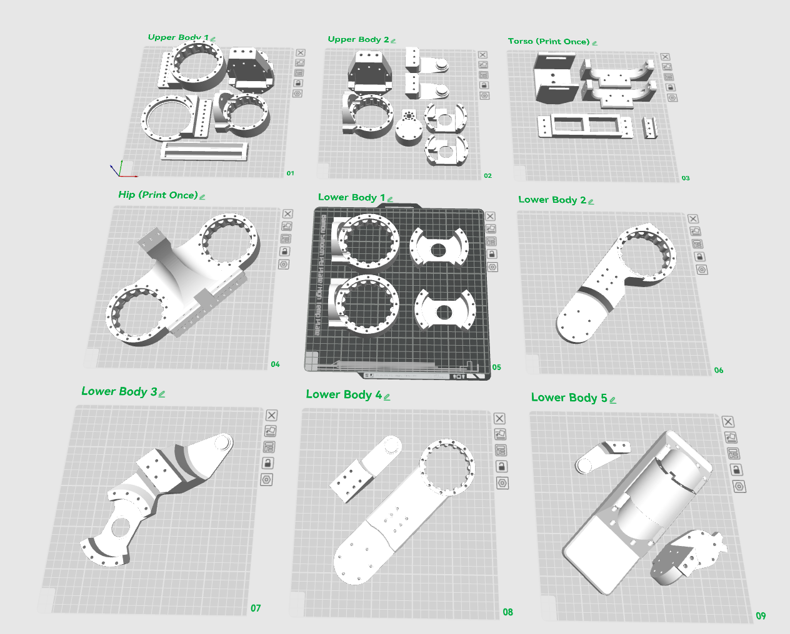<figcaption></figcaption></figure>

Parts on the Upper Body and Lower Body plates need to be printed twice in mirrored setting to assemble the two arms and two legs. This can be achieved by right-clicking the part and selet "mirror along X axis".

The structural parts does not require the high precision as the actuator modules, so they can be printed at a faster speed setting.


---

# Agent Instructions: Querying This Documentation

If you need additional information that is not directly available in this page, you can query the documentation dynamically by asking a question.

Perform an HTTP GET request on the current page URL with the `ask` query parameter:

```
GET https://berkeley-humanoid-lite.gitbook.io/docs/getting-started-with-hardware/3d-printing-instructions.md?ask=<question>
```

The question should be specific, self-contained, and written in natural language.
The response will contain a direct answer to the question and relevant excerpts and sources from the documentation.

Use this mechanism when the answer is not explicitly present in the current page, you need clarification or additional context, or you want to retrieve related documentation sections.
