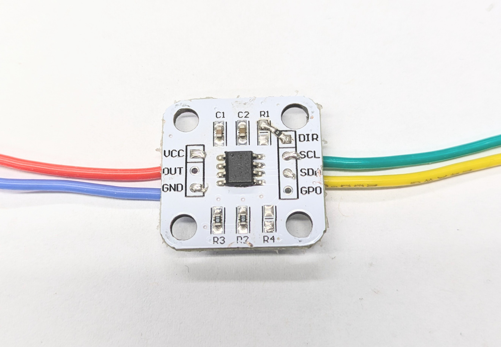
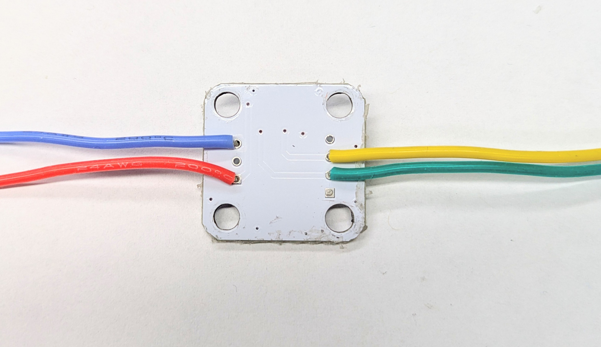
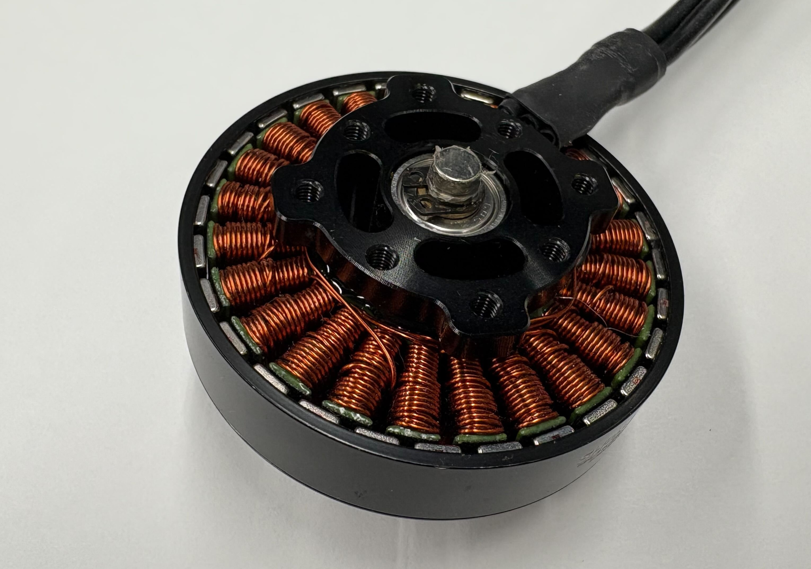
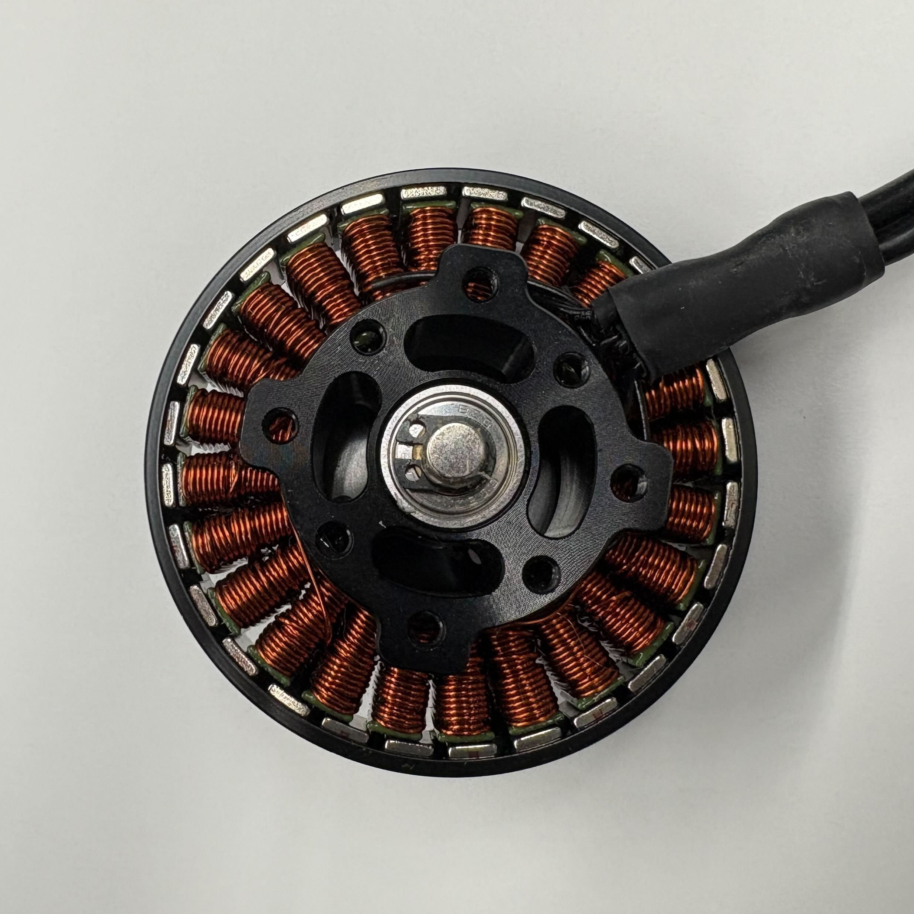
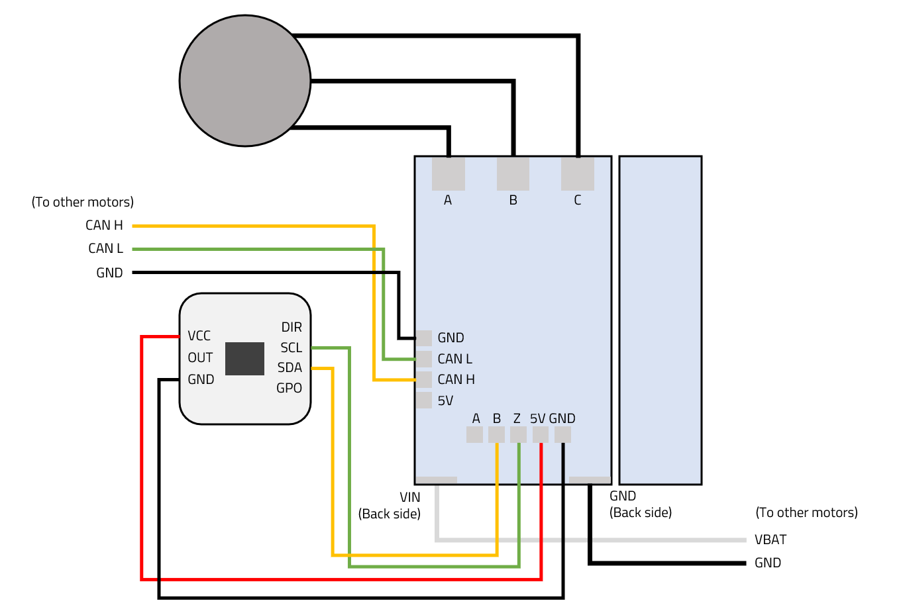
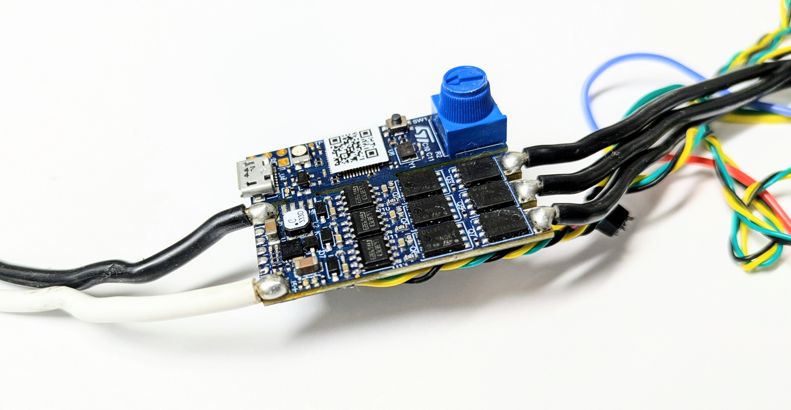
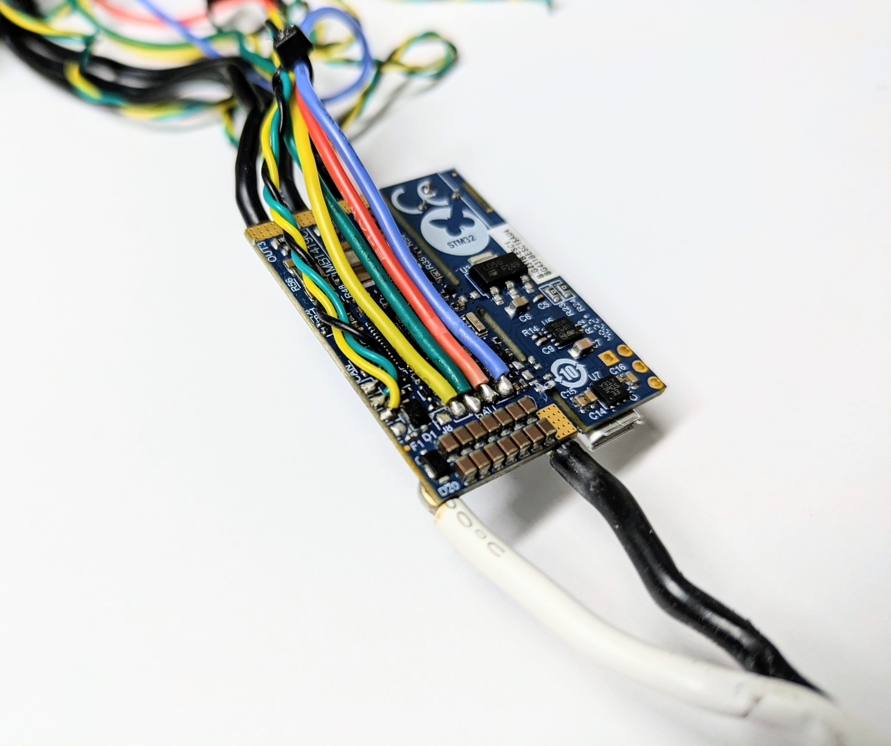

# Building the Actuator

Now that we have gathered all the necessary tools and parts, we are ready to begin the assembly process.

## Preparing the magnetic encoder

We need to change the configuration of the AS5600 magnetic encoder by swapping out a few resistors on the board. Please follow [this tutorial](https://notes.tk233.xyz/electrical/as5600-modification) or the video below to perform the modification.



After moving the resistors, also solder the VCC, GND, SDA, and SCL wires on the corresponding pads.

<figure><figcaption></figcaption></figure>

<figure><figcaption></figcaption></figure>

## Preparing the motor

Use some hot glue to stick the magnet to the shaft of the motor rotor.

The image below shows an example for the 5010 motor. For M6C12 motor, instead of the clip, it uses a screw at the end of the shaft to hold everything together, but the procedure to mount the magnet is the same.



## Note

Be sure to use the magnet that comes with the encoder. These magnet are magnetically charged along the radial axis, while normal round magnets are charged along the cylinder axis and does not work with the encoder.


<figure><figcaption></figcaption></figure>

<figure><figcaption></figcaption></figure>

## Assembling the actuator

Please follow this video tutorial to assemble the actuator.



## Soldering

Connect the encoder, motor, and the motor controller together according to the following wiring diagram.

<figure><figcaption></figcaption></figure>



## Warning

The CAN port solder pads on the ECS are *very fragile* and very susceptible to breaking off the FR4 base layer. Please be extra cautious when soldering and handling it. Do not apply excessive force on the cables and the pads.




### Hint

The solder pads of the encoder and CAN are tricky to work with. It requires some degrees of familarity of soldering. Our suggestion is that adding more flux makes it easier to have a more solid solder joint.


## Cable selection

For power cables, we are using **14 AWG** (14 Gauge) stranded silicone wire. The color coding convension is white/red for positive, and black for ground.

For CAN cables, we are using **30 AWG** (30 Gauge) stranded silicone wire. The color coding convension is yellow for CAN-H and SDA, green for CAN-L and SCL.

## Results

Here are some photos of the finished motor controller for your reference:

<figure><figcaption></figcaption></figure>

<figure><figcaption></figcaption></figure>


---

# Agent Instructions: Querying This Documentation

If you need additional information that is not directly available in this page, you can query the documentation dynamically by asking a question.

Perform an HTTP GET request on the current page URL with the `ask` query parameter:

```
GET https://berkeley-humanoid-lite.gitbook.io/docs/getting-started-with-hardware/building-the-actuator.md?ask=<question>
```

The question should be specific, self-contained, and written in natural language.
The response will contain a direct answer to the question and relevant excerpts and sources from the documentation.

Use this mechanism when the answer is not explicitly present in the current page, you need clarification or additional context, or you want to retrieve related documentation sections.
