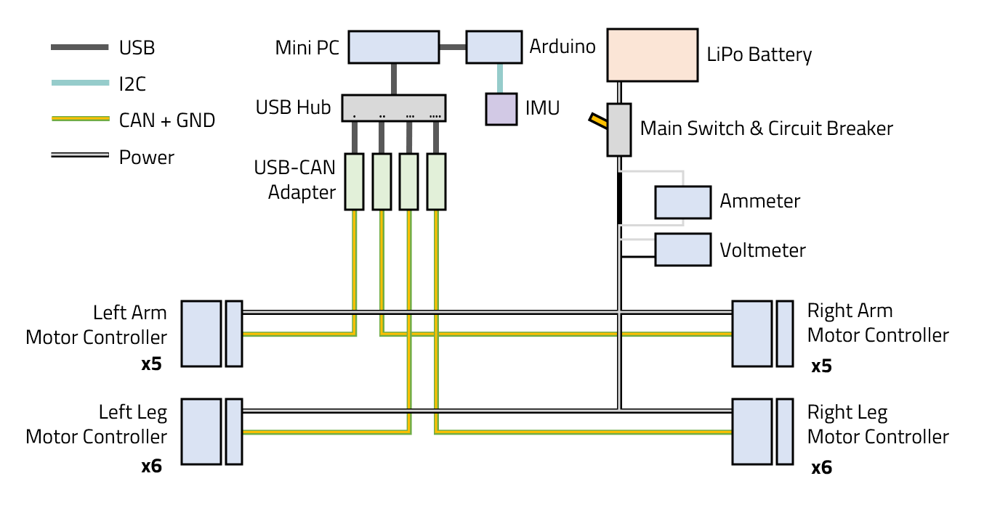
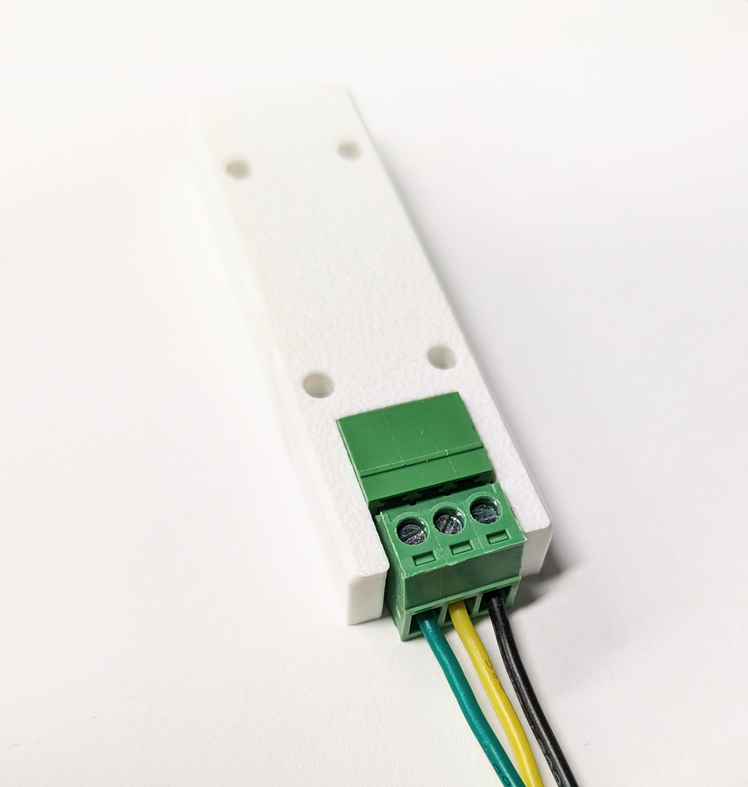
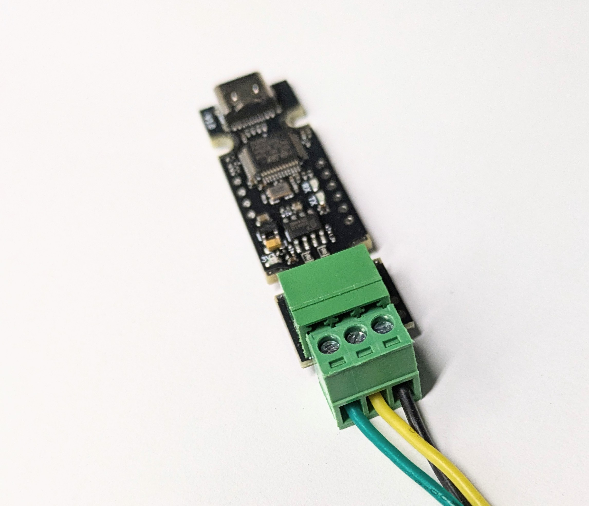
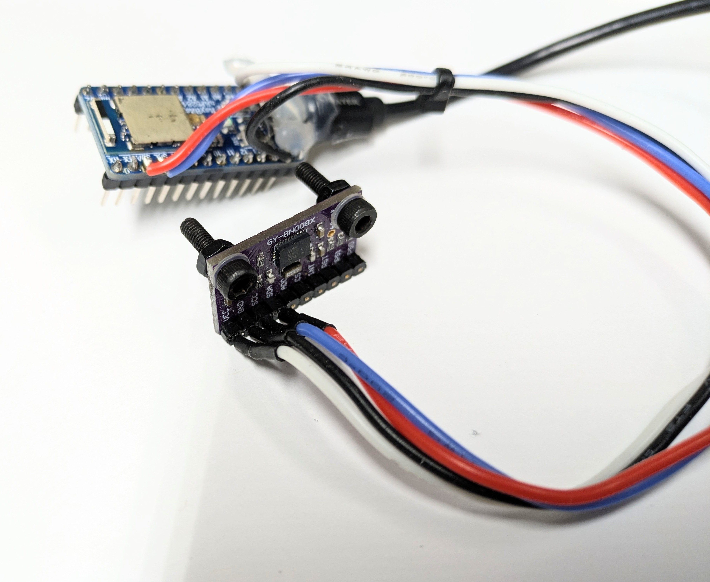
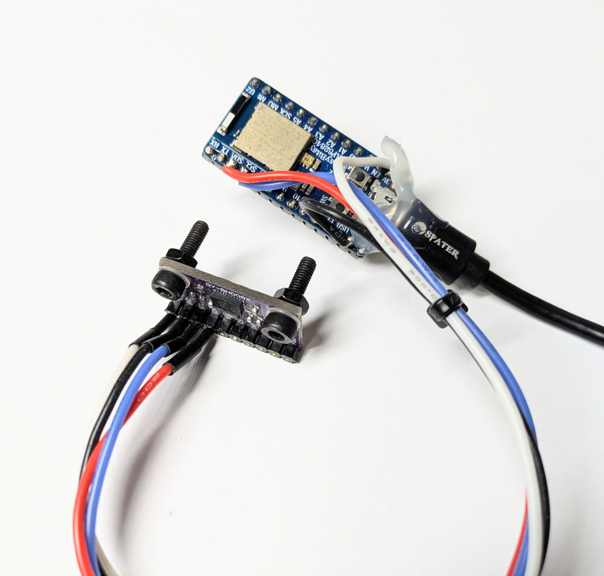
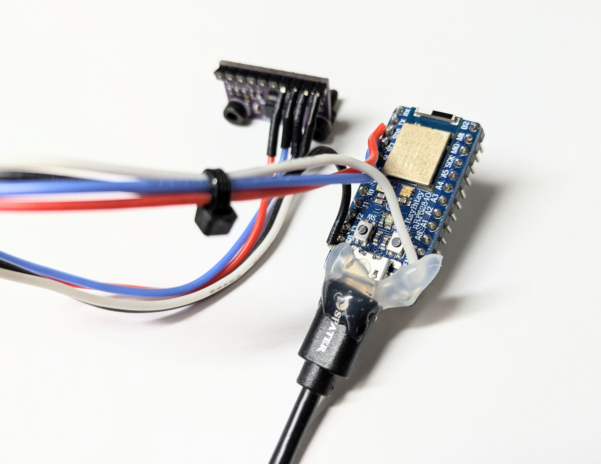

# Building the Robot

Please follow these video tutorials to assemble the robot.

## Arm



## Leg



## Entire robot



## Wiring

After building the mechanical structure of the robot, connect the electrical components following this wiring diagram:

<figure><figcaption></figcaption></figure>

### Connecting CAN bus to the USB-CAN Adapter

The cables can be directly attache to the screw terminal on the USB-CAN adapter board. The ordering is CAN-L, CAN-H, GND. The signal names are also labeled at the back side of the PCB.

<figure><figcaption></figcaption></figure>

<figure><figcaption><p>Photo of the connection without the 3D printed case for better clarity</p></figcaption></figure>

### Joining the cables together

There are multiple ways to join the signal and power cables together. We provide our recommended ways for you reference.

For signal cables, we recommend directly solder them together and protect the solder joints with heat shrink tubes.

<figure><figcaption></figcaption></figure>

When first connecting power cables together, for easier debugging, the WAGO connectors can be used to quickly joining and detaching each actuators to the main power bus without soldering. They are available in multiple types, and we use both the two, three, and five ports on the robot.

<figure><figcaption></figcaption></figure>

For a more permanant build, we recommend to solder the cables together directly. [This video](https://youtu.be/4xUBRMgcVhc?t=437\&si=RwDLI2K0Sdax4TTa) by Will Donaldson provides a good guide on how to solder these thicker cables. Between the actuators, the cables can be connected with XT30 and XT60 connectors. We use XT60 to connect the main cable together, with each actuator connected to this main power bus using XT30 connectors.&#x20;

<figure><figcaption></figcaption></figure>

### IMU Connection

For the original version, we use an Arduino Nano to connect the IMU to the computer. Here are some photos of the connection for your reference.

<div><figure><figcaption></figcaption></figure> <figure><figcaption></figcaption></figure> <figure><figcaption></figcaption></figure></div>

We later found out this [IM10A IMU](https://www.hiwonder.com/products/imu-module?variant=40375875338327) that directly supports USB connection. Hence, we strongly recommend to use this IMU to avoid manually soldering the signal wires. The BOM is also updated to include this component.&#x20;

A detailed performance comparision between these two IMUs is available here:


[IMU Comparision](/docs/in-depth-contents/imu-comparision.md)



---

# Agent Instructions: Querying This Documentation

If you need additional information that is not directly available in this page, you can query the documentation dynamically by asking a question.

Perform an HTTP GET request on the current page URL with the `ask` query parameter:

```
GET https://berkeley-humanoid-lite.gitbook.io/docs/getting-started-with-hardware/building-the-robot.md?ask=<question>
```

The question should be specific, self-contained, and written in natural language.
The response will contain a direct answer to the question and relevant excerpts and sources from the documentation.

Use this mechanism when the answer is not explicitly present in the current page, you need clarification or additional context, or you want to retrieve related documentation sections.
