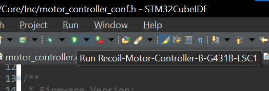
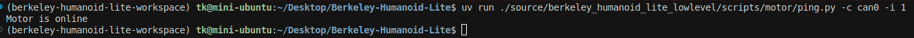

# Flashing the Motor Controllers

We are going to use [STM32CubeIDE](https://www.st.com/en/development-tools/stm32cubeide.html) to flash the motor controllers.



After setting up STM32CubeIDE, download the firmware codebase from the [repository](https://github.com/T-K-233/Recoil-Motor-Controller-BESC).

```bash
git clone https://github.com/T-K-233/Recoil-Motor-Controller-BESC.git
```

## Initial flash configuration

Because we are using the internal Flash of STM32 to store our motor configuration parameters, we need to configure the Flash protection to allow us to read and write to the pages.

Go to `Core/Inc/motor_controller_conf.h` and set the `FIRST_TIME_BOOTUP` flag to be 1.

```diff
/**
 * First Time Bootup Flag:
 * If this is the first time the device is programmed, set this flag to 1 to configure Flash option byte.
 */
- #define FIRST_TIME_BOOTUP               0             // Set to 1 for the first-time bootup routine, 0 for normal operation
+ #define FIRST_TIME_BOOTUP               1             // Set to 1 for the first-time bootup routine, 0 for normal operation
```

Connect the motor controller to the computer via the Micro USB port on the controller board. STM32CubeIDE should automatically detect the new device. Then, click the "Run" button.

<figure><figcaption></figcaption></figure>

For brand new boards, it will prompt a ST-LINK debugger firmware update. Click accept and perform firmware upgrade according to its instructions. After that, click "Run" again.

After flashing with the initial configuration program, power-cycle the board by unplug and plug in again the USB cable. Then, change the `FIRST_TIME_BOOTUP` flag back to 0.

## Configuring actuator parameters

Now we need to load the correct actuator parameters into the Flash.&#x20;

The fields that needs to be configured is also in this header file. First, configure the CAN ID according to the [Joint ID Mapping](/docs/in-depth-contents/joint-id-mapping.md). Then, scroll down and uncomment the corresponding motor type.

Set `LOAD_ID_FROM_FLASH` and `LOAD_CONFIG_FROM_FLASH` flags to 0 so that our program can override the default random values in the Flash.&#x20;

```diff
/**
 * Device CAN ID:
 * This macro defines the CAN (Controller Area Network) ID of the device.
 * The CAN ID is a unique identifier for the device on the CAN bus.
 * The value should be set in range [1, 63].
 */
- #define DEVICE_CAN_ID                   1
+ #define DEVICE_CAN_ID                   <correct-can-id>

/**
 * First Time Bootup Flag:
 * If this is the first time the device is programmed, set this flag to 1 to configure Flash option byte.
 */
#define FIRST_TIME_BOOTUP               0             // Set to 1 for the first-time bootup routine, 0 for normal operation


/**
 * Load ID from Flash Flag:
 * This flag specifies whether the device should load the ID configuration from Flash memory.
 */
- #define LOAD_ID_FROM_FLASH              1             // Set to 1 to load ID config from Flash, 0 to load default values
+ #define LOAD_ID_FROM_FLASH              0             // Set to 1 to load ID config from Flash, 0 to load default values

/**
 * Load Config from Flash Flag:
 * This flag specifies whether the device should load the configuration settings from Flash memory.
 * It excludes loading motor flux offset and CAN ID.
 */
- #define LOAD_CONFIG_FROM_FLASH          1             // Set to 1 to load config settings (everything except
+ #define LOAD_CONFIG_FROM_FLASH          0             // Set to 1 to load config settings (everything except
                                                      // motor flux offset and can id) from Flash, 0 to load default values
/**
 * Load Calibration from Flash Flag:
 * This flag indicates whether the device should load the encoder flux offset settings from Flash memory.
 */
#define LOAD_CALIBRATION_FROM_FLASH     1             // Set to 1 to load calibration settings, 0 to load default values


/** ======== Motor Selection ======== **/

// uncomment the motor that you are using
//#define MOTORPROFILE_MAD_M6C12_150KV
//#define MOTORPROFILE_MAD_5010_110KV
//#define MOTORPROFILE_MAD_5010_310KV
//#define MOTORPROFILE_MAD_5010_370KV
```

Load the program into the motor controller by clicking "Run" button.&#x20;

To be extra safe, after this second flashing, do the unplug and plug again to make sure that flash option is successfully loaded. The LED should blink at around 1 Hz, indicating that our program is loaded and executing correctly.

Finally, change the configuration flags back to 1 and click "Run" to flash one last time.

At this point, the "Run" button should be clicked four times, and both the firmware and configuration parameters should be loaded to the motor controller.

Here is a video walkthrough of the procedure:



## Calibrate the actuator

The easiest way to do this is to directly use the on-board computer on the robot after finishing [The On-board Computer](/docs/getting-started-with-software/the-on-board-computer.md) section.

Connect the CAN bus of the actuator to the computer through the USB-CAN adapter. Then, power on the actuator.

Before running the python script, you need to run this script to start the socket CAN transport on the computer:

```bash
sudo ip link set can0 up type can bitrate 1000000
```

Then, check the connection to the actuator by running



```basic
uv run ./source/berkeley_humanoid_lite_lowlevel/scripts/motor/ping.py -c can0 -i 1
```



The `-c` argument specifies which CAN transport to use (here we are using `can0`, the number increases as we connect more USB-CAN adapter devices), and the `-i` argument specifies the device's CAN ID.

If everthing goes well, the script should print "Motor is online":

<figure><figcaption></figcaption></figure>

If the script prints "Motor is offline", double check your signal cable connection, power, and CAN ID settings.

Now, we can run this program to calibrate the electrical position offset. Make sure nothing is attached to the actuator and it is free to spin.



```bash
uv run ./source/berkeley_humanoid_lite_lowlevel/scripts/motor/calibrate_electrical_offset.py -c can0 -i 1
```





## WARNING

The motor will spin and draw quite amount of current (\~ 1 A from power supply). Make sure the power cables are connected properly and the actuator is free to spin.


The motor will slowly increase the holding torque until the phase current reaches the target value, then rotate counter-clockwise (CCW) for one full mechanical rotation, and finally rotate back clockwise (CW) for one rotation.



## Note

If the rotation direction is flipped (first rotate CW, and then CCW), you can do one of the following to correct this:

1\) swap any two of the three motor phase wires;

or

2\) change the [MOTOR\_PHASE\_ORDER](https://github.com/T-K-233/Recoil-Motor-Controller-BESC/blob/main/Recoil-Motor-Controller-B-G431B-ESC1/Core/Inc/motor_controller_conf.h#L77) in the firmware to `-1`.


Here is a video showcasing the calibration procedure:



## Moving the actuator

We also provided a simple script to command the actuator to rotate, following a sinosoidal position curve. Use this command to run it:



```bash
uv run ./source/berkeley_humanoid_lite_lowlevel/scripts/motor/move_actuator.py -c can0 -i 1
```





## CAUTION

The motor will spin. Start with a small kP, kD, and torque limit value to gain confidence on how the actuator will behave. If anything unexpected happens, press Ctrl+C to kill the program to stop the actuator.


This video demonstrate how it looks:




---

# Agent Instructions: Querying This Documentation

If you need additional information that is not directly available in this page, you can query the documentation dynamically by asking a question.

Perform an HTTP GET request on the current page URL with the `ask` query parameter:

```
GET https://berkeley-humanoid-lite.gitbook.io/docs/getting-started-with-hardware/flashing-the-motor-controllers.md?ask=<question>
```

The question should be specific, self-contained, and written in natural language.
The response will contain a direct answer to the question and relevant excerpts and sources from the documentation.

Use this mechanism when the answer is not explicitly present in the current page, you need clarification or additional context, or you want to retrieve related documentation sections.
