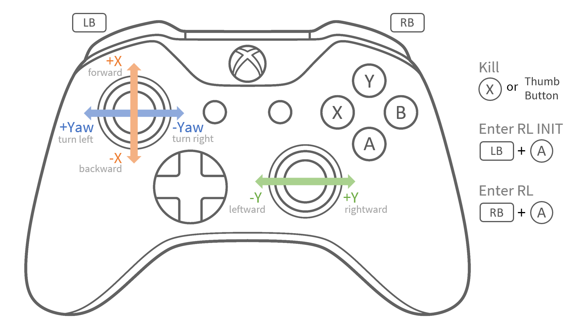

# Sim2sim Validation

After finish training the policy, we can first put it into a different physics simulator to validate the policy. This procedure is typically called sim2sim validation.

Here, we use [MuJoCo](https://mujoco.org/) as the sim2sim physics engine.

## Controller

The sim2sim will read user commands from a gamepad controller, just like what the real robot would do. Plug the joystick controller in the host computer before running the sim2sim script.



## Note

Getting USB gamepad controller working in Linux might be tricky. Here are some resources that might be helpful if you run into troubles reading from the joystick:

* <https://notes.tk233.xyz/tools/ubuntu/solving-gamepad-not-detected-on-ubuntu-22.04>
* <https://unix.stackexchange.com/questions/559652/udev-rule-doesnt-trigger-when-usb-gamepad-connected>
* <https://www.xmodulo.com/change-usb-device-permission-linux.html>
* <https://hackaday.com/2009/09/18/how-to-write-udev-rules/>
  

## Launching the MuJoCo environment

After everything is set up, we can now test our newly trained policy in MuJoCo!

Run this script to launch the sim2sim environment. The Python script creates threads to handle joystick and policy inference. These threads communicate with the main physics simulation thread via UDP, mimicing the real-world deployment scenario.




```bash
uv run ./scripts/sim2sim/play_mujoco.py --config ./configs/policy_latest.yaml
```





```bash
python ./scripts/sim2sim/play_mujoco.py --config ./configs/policy_latest.yaml
```




Replace the file argument after `--config` to test different policies.

By default, the policy is trained to follow user command of linear velocity on X (forward-backward) and Y (sideways) axes, and angular velocity on Z (turning).

<figure><figcaption></figcaption></figure>


---

# Agent Instructions: Querying This Documentation

If you need additional information that is not directly available in this page, you can query the documentation dynamically by asking a question.

Perform an HTTP GET request on the current page URL with the `ask` query parameter:

```
GET https://berkeley-humanoid-lite.gitbook.io/docs/getting-started-with-software/sim2sim-validation.md?ask=<question>
```

The question should be specific, self-contained, and written in natural language.
The response will contain a direct answer to the question and relevant excerpts and sources from the documentation.

Use this mechanism when the answer is not explicitly present in the current page, you need clarification or additional context, or you want to retrieve related documentation sections.
