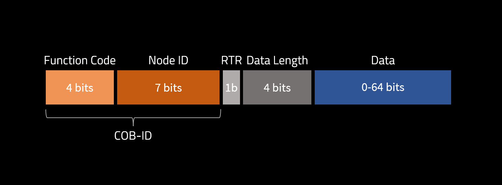
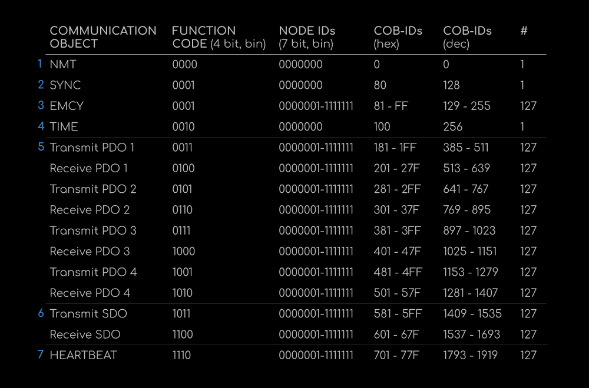

# CAN Communication

The CAN frame is designed to mimic CANOpen communication protocol.

The CAN ID field is divided into two fields, a 4-bit function code and a 7-bit node ID.

<figure><figcaption></figcaption></figure>

<figure><figcaption></figcaption></figure>

## NMT Network Management

The NMT frame is used to configure the operational mode of the motor controller.

To configure the operational mode, the master sends an NMT frame to the slave device. In the NMT frame, byte 0 is set to be the requested mode, and byte 1 is set to be the target device ID.

## SDO Service Data Object

The SDO frames are used to configure the device parameters.

To read the current value from a parameter, the master sends out a RECEIVE\_SDO frame. The 5-7 bit in byte 0 should be set to 2 (upload). Byte 1-2 should be set to the address of the target parameter.

After sending, the master should listen for a TRANSMIT\_SDO frame from the slave device. Byte 0-3 should contain the resulting data.

To write a new value to a parameter, the master sends out a RECEIVE\_SDO frame. The 5-7 bit in byte 0 should be set to 1 (download). Byte 1-2 should be set to the address of the target parameter. Byte 4-7 should contain the new value of the parameter. The slave does not transmit a response for write requests.

## PDO 1 Process Data Object 1

The PDO1 frame is used to detect if the target device is present on the bus. The frame can also be used for debugging purpose.

The master sends out a RECEIVE\_PDO\_1 frame.

The slave will respond with a TRANSMIT\_PDO\_1 frame. The data will echo the received frame.

## PDO 2 Process Data Object 2

The PDO2 frame is used for normal control.

The master sends out a RECEIVE\_PDO\_2 frame. The data field contains the target position and velocity in fp32 format.

The slave will respond with a TRANSMIT\_PDO\_2 frame. The data field contains the measured position and measured velocity in fp32 format.

## PDO 3 Process Data Object 3

The PDO3 frame is used for torque compensation control.

The master sends out a RECEIVE\_PDO\_3 frame. The data field contains the target position and target feed-forward torque in fp32 format.

The slave will respond with a TRANSMIT\_PDO\_3 frame. The data field contains the measured position and measured torque in fp32 format.

## PDO 4 Process Data Object 4

The PDO4 frame is used for event-driven update frame.

When fast-frame update is enabled, the slave will periodically send out TRANSMIT\_PDO\_4 frames containing the current measured position and velocity.

## FLASH Flash Operation

The FLASH frame is used to save and load the configuration parameters.

When storing the current parameters to flash, the master sends out a FLASH frame. Byte 0 should set to 1 (store).

When loading the current parameters to flash, the master sends out a FLASH frame. Byte 0 should set to 2 (load).

In both cases, the slave will not respond frame.

## HEARTBEAT Heartbeat

The HEARTBEAT frame is used to update the safety watchdog timer.

The master sends out a HEARTBEAT frame. Upon receiving the frame, the slave will reset its safety watchdog timer.

## Troubleshoot the CAN communication

```bash
ip -details -statistics link show canX
```

Log all data and error frames

```bash
candump -l any,0:0,#FFFFFFFF
```

Example:

```bash
tk@tk-MINI-S:~/Desktop/berkeley_humanoid_lite_lowlevel$ ip -details -statistics link show can2
10: can2: <NOARP,UP,LOWER_UP,ECHO> mtu 16 qdisc pfifo_fast state UP mode DEFAULT group default qlen 10
    link/can  promiscuity 0 minmtu 0 maxmtu 0 
    can state ERROR-ACTIVE restart-ms 0 
          bitrate 1000000 sample-point 0.750 
          tq 62 prop-seg 5 phase-seg1 6 phase-seg2 4 sjw 1
          gs_usb: tseg1 1..16 tseg2 1..8 sjw 1..4 brp 1..1024 brp-inc 1
          clock 48000000 
          re-started bus-errors arbit-lost error-warn error-pass bus-off
          0          0          0          0          0          0         numtxqueues 1 numrxqueues 1 gso_max_size 65536 gso_max_segs 65535 parentbus usb parentdev 1-3.3:1.0 
    RX:  bytes packets errors dropped  missed   mcast           
             0       0      0       0       0       0 
    TX:  bytes packets errors dropped carrier collsns           
             0       0      0       0       0       0 
tk@tk-MINI-S:~/Desktop/berkeley_humanoid_lite_lowlevel$ ip -details -statistics link show can3
11: can3: <NOARP,UP,LOWER_UP,ECHO> mtu 16 qdisc pfifo_fast state UP mode DEFAULT group default qlen 10
    link/can  promiscuity 0 minmtu 0 maxmtu 0 
    can state ERROR-ACTIVE restart-ms 0 
          bitrate 1000000 sample-point 0.750 
          tq 62 prop-seg 5 phase-seg1 6 phase-seg2 4 sjw 1
          gs_usb: tseg1 1..16 tseg2 1..8 sjw 1..4 brp 1..1024 brp-inc 1
          clock 48000000 
          re-started bus-errors arbit-lost error-warn error-pass bus-off
          0          0          0          0          0          0         numtxqueues 1 numrxqueues 1 gso_max_size 65536 gso_max_segs 65535 parentbus usb parentdev 1-3.4:1.0 
    RX:  bytes packets errors dropped  missed   mcast           
             0       0      0       0       0       0 
    TX:  bytes packets errors dropped carrier collsns           
             0       0      0       0       0       0 

```

## Minimizing the CAN noise

Here are some good resources on how to properly do CAN electrical connections:

Decap and common-mode choke: <https://community.st.com/t5/stm32-mcus-products/can-bus-massive-noise-on-the-bus-when-a-power-converter-starts/td-p/682045>

Split termination: <https://electronics.stackexchange.com/questions/512653/can-split-termination-capacitor-calculation>

How Termination CAN Improve EMC Performance in a
&#x20;CAN Transceiver: <https://www.ti.com/lit/ta/ssztam0/ssztam0.pdf?ts=1750097536718>


---

# Agent Instructions: Querying This Documentation

If you need additional information that is not directly available in this page, you can query the documentation dynamically by asking a question.

Perform an HTTP GET request on the current page URL with the `ask` query parameter:

```
GET https://berkeley-humanoid-lite.gitbook.io/docs/in-depth-contents/can-communication.md?ask=<question>
```

The question should be specific, self-contained, and written in natural language.
The response will contain a direct answer to the question and relevant excerpts and sources from the documentation.

Use this mechanism when the answer is not explicitly present in the current page, you need clarification or additional context, or you want to retrieve related documentation sections.
