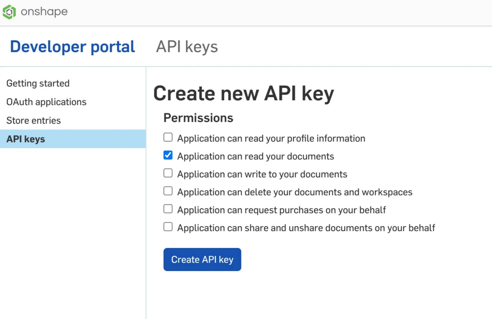

# Exporting Robot Description Files from Onshape

## Setting up Onshape developer key

Get API key from the Onshape Developer Portal



When creating the key, make sure that at least “Application can read your documents” is selected.

<figure><figcaption></figcaption></figure>

export the key as environment variable

```bash
export ONSHAPE_API=https://cad.onshape.com
export ONSHAPE_ACCESS_KEY=Your_Access_Key
export ONSHAPE_SECRET_KEY=Your_Secret_Key
```



## Note

It might be more convenient to put the above three lines into a file and source it everything we need it.

For example, we can do

```bash
source ~/Documents/onshape-api-key.sh
```



## Generating the description files

Please refer to the [README](https://github.com/HybridRobotics/Berkeley-Humanoid-Lite-Assets) of Berkeley-Humanoid-Lite-Assets repository for more information and instructions.


---

# Agent Instructions: Querying This Documentation

If you need additional information that is not directly available in this page, you can query the documentation dynamically by asking a question.

Perform an HTTP GET request on the current page URL with the `ask` query parameter:

```
GET https://berkeley-humanoid-lite.gitbook.io/docs/in-depth-contents/exporting-robot-description-files-from-onshape.md?ask=<question>
```

The question should be specific, self-contained, and written in natural language.
The response will contain a direct answer to the question and relevant excerpts and sources from the documentation.

Use this mechanism when the answer is not explicitly present in the current page, you need clarification or additional context, or you want to retrieve related documentation sections.
