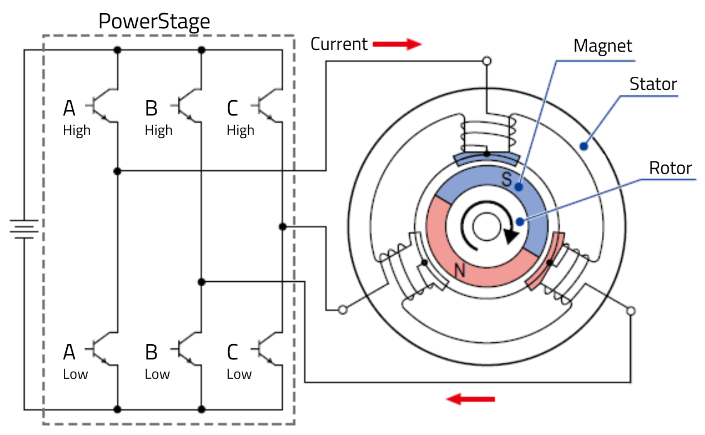
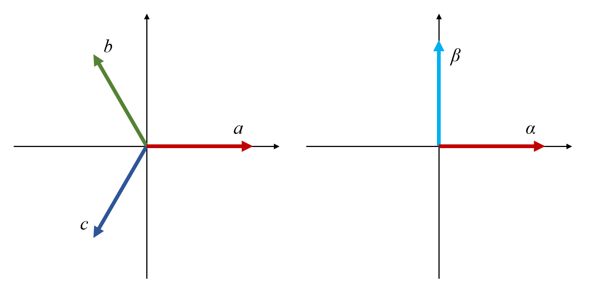
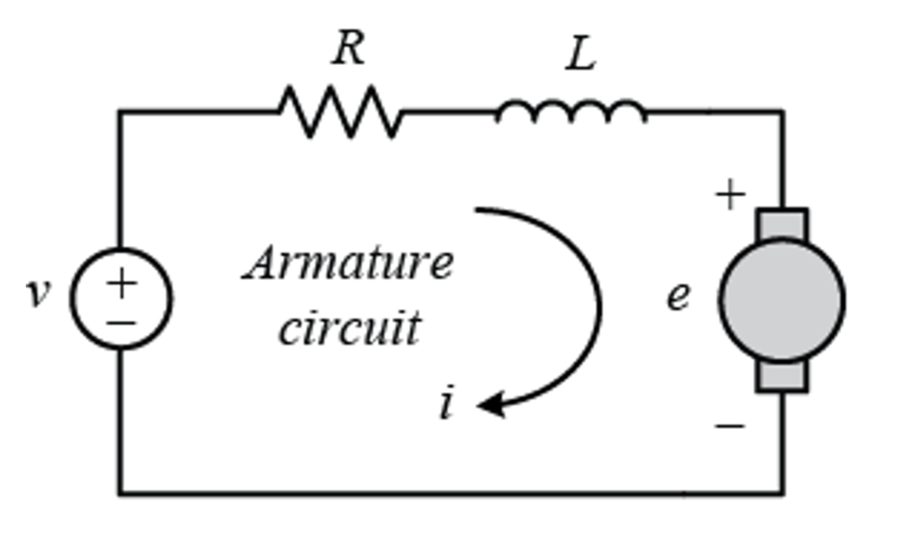
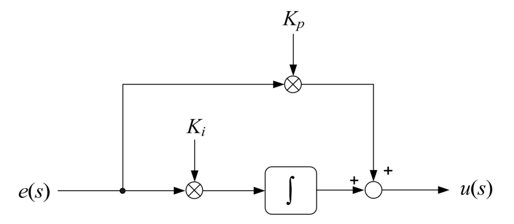
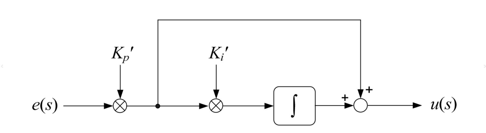
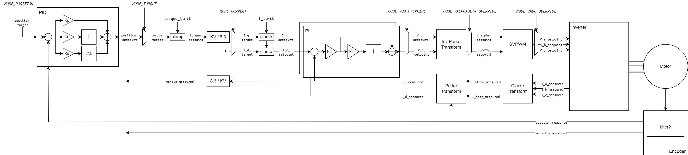

# Field Oriented Control (FOC) Operation

## 1. Brushless DC Motor

A brushless direct-current (BLDC) motor consists of magnets and phase-winding coils. To illustrate its operating principle, consider a simplified model featuring one pair of magnetic poles and three coils.

<figure><figcaption></figcaption></figure>

In this model, the coils form the stator. When current flows through a coil, it generates a magnetic field that either attracts or repels the adjacent magnet on the rotor. This magnetic interaction causes the rotor to rotate.

## 2. A Simple Control Scheme: Six-Step Commutation

In a BLDC motor, the ends of the three coils are connected to form three external terminals that interface with the driving circuit. These coils can be connected either in a star (wye) configuration or a delta configuration. The star connection is more common: one end of each coil is accessible as an external lead, while the other ends are joined internally to form a neutral point.

To control the three wires, a three-phase inverter circuit is used. This inverter is composed of three half-bridge drivers, which can be viewed as six switches connecting between VDD and ground. Each half-bridge can operate in one of four states:

* High-side ON, low-side OFF (**1**)
* High-side OFF, low-side ON (**0**)
* High-side ON, low-side ON (**X**)
* High-side OFF, low-side OFF (**N**)

The **X** state is invalid because it directly connects VCC to ground, while the **N** state is not used because it leaves the phase coil in a floating condition, reducing the driver’s maximum output capability. This leaves only two valid states: state **1** connects the phase to VCC, and state **0** connects it to ground.

By combining these two valid states for the three phases, there are eight possible inverter states:

* 000
* 100
* 110
* 010
* 011
* 001
* 101
* 111

Out of these, the states **000** and **111** are non-driving because all phases are tied to the same voltage level (either VCC or ground), resulting in no voltage differential between them. The remaining six states are the driving states.

For example, consider the motor in state **100**:

* **Phase A** is connected to VCC.
* **Phases B and C** are connected to ground.

In this configuration, current flows from phase A through the neutral point to phases B and C, and then to ground. This current generates a magnetic field oriented toward phase A (0°), which attracts the rotor's magnets and rotates the rotor to 0°.

Next, switching to state **110**:

* **Phases A and B** are connected to VCC.
* **Phase C** is connected to ground.

This creates a magnetic field pointing between phases A and B (approximately 30°), which turns the rotor toward the 30° direction.

Similarly, the remaining driving states sequentially direct the rotor to 60°, 90°, 120°, 150°, and finally back to 0° when returning to state **100**.

By switching through these states in order, the motor can be driven continuously and efficiently.

**Reference**: [Six Step Commutation - MathWorks](https://www.mathworks.com/help/mcb/ref/sixstepcommutation.html)

## 3. Efficiency Improved: Vector Control

By analyzing the magnetic forces generated from the stator winding acting on the rotor, we can decompose the overall force into two orthogonal components: one aligned with the rotor’s magnetic field (the d-axis component, $$F\_d$$) and one perpendicular to it (the q-axis component, $$F\_q$$). In vector control, only the perpendicular component, $$F\_q$$, contributes to generating torque. The component $$F\_d$$, which is parallel to the rotor magnet, does not aid in rotation and is essentially wasted energy.

To drive the motor efficiently, the control strategy aims to minimize $$F\_d$$ while maximizing $$F\_q$$, thereby ensuring that most of the electrical energy is converted into useful rotational force.

## 4. Frame Transformation

Since the motor’s phase voltages are floating and lack a fixed reference point, it is impractical to use power resistors for sampling. A simpler approach is to add resistors under the low-side MOSFETs, which allows us to sample and obtain three approximate sine-wave phase currents. However, the resulting measurement would yield three sinusoidal signals that are correlated with each other. This makes designing the controller for it very challenging. Instead, with the use of a series of mathematical transformations, we can convert the three phase BLDC motor model into a two phase DC motor model.

Tracking the transformation between these two models can be particularly challenging due to differences in reference frames. In the three-phase BLDC motor model, physical quantities are defined relative to each individual phase, with the reference frame rotating along with the rotor. In contrast, the simplified two-phase DC motor model defines quantities with respect to the orthogonal D (direct) and Q (quadrature) axes within a stationary reference frame.

It's essential to pay close attention to the frame in which each variable is defined. In the following discussion, we will clearly state the reference frame along with the corresponding variables.

### Alpha Beta Transform

The three phase currents $$I\_a$$, $$I\_b$$, and $$I\_c$$ are three sinusoidal, rotating vectors, each offset by 120° relative to the others. Since they all lie in the same plane, the [Clarke transform](https://www.mathworks.com/help/mcb/ref/clarketransform.html) (also named [alpha-beta transform](https://en.wikipedia.org/wiki/Alpha%E2%80%93beta_transformation)) can be used to reduce them into two orthogonal components, $$I\_\alpha$$ and $$I\_\beta$$.

<figure><figcaption></figcaption></figure>

First, we can express $$I\_\alpha$$ and $$I\_\beta$$ in terms of $$I\_a$$, $$I\_b$$, and $$I\_c$$:

$$
\begin{aligned}

I\_\alpha &= I\_a + \cos(\frac{2}{3}\pi)I\_b + \cos(\frac{4}{3}\pi)I\_c \\

I\_\beta &= \sin(\frac{2}{3}\pi) I\_b + \sin(\frac{4}{3}\pi)I\_c

\end{aligned}
$$

Using Kirchhoff Circuit Laws, $$I\_c = I\_a + I\_b$$, we can further simplify the equation to be the following

$$
\begin{aligned}

I\_\alpha &= I\_a + \cos(\frac{2}{3}\pi)I\_b + \cos(\frac{4}{3}\pi)I\_c \\

&= I\_a + \cos(\frac{2}{3}\pi)I\_b - \cos(\frac{4}{3}\pi)I\_a - \cos(\frac{4}{3}\pi)I\_b \\

&= I\_a - \frac{1}{2}I\_b + \frac{1}{2}I\_a + \frac{1}{2}I\_b \\

&= \frac{3}{2}I\_a

\end{aligned}
$$

$$
\begin{aligned}

I\_\beta &= \sin(\frac{2}{3}\pi) I\_b + \sin(\frac{4}{3}\pi)I\_c \\

&= \sin(\frac{2}{3}\pi) I\_b - \sin(\frac{4}{3}\pi)I\_a - \sin(\frac{4}{3}\pi)I\_b \\

&= \frac{\sqrt{3}}{2}I\_b + \frac{\sqrt{3}}{2}I\_a + \frac{\sqrt{3}}{2}I\_b \\

&= \frac{\sqrt{3}}{2}I\_a + \sqrt{3}I\_b

\end{aligned}
$$

However, we also need to ensure that the magnitude of the signal should match. Therefore, we need to scale the result by factor of $$N$$.



#### Note

In an amplitude-invariant transformation, the normalization factor $$N$$ should be set to $$2 / 3$$, while a power-invariant transformation requires $$N = \sqrt{2/3}$$.

For this FOC application, it is important to preserve the magnitude of the signals (i.e. phase current readings) during transformation, so we choose, so we set  $$N = 2/3$$.

[reference](https://zhuanlan.zhihu.com/p/172484981)


After magnitude scaling, we get the final Clarke transform equation:

$$
\begin{cases}

I\_\alpha = I\_a \\

I\_\beta = \frac{\sqrt{3}}{3}I\_a + \frac{2\sqrt{3}}{3}I\_\beta

\end{cases}
$$

or in matrix format:

$$
\begin{bmatrix}
I\_\alpha \\
I\_\beta
\end{bmatrix}

\= \begin{bmatrix}
1 & 0 & 0 \\
\frac{\sqrt{3}}{3} & \frac{2\sqrt{3}}{3} & 0
\end{bmatrix}

\begin{bmatrix}
I\_a \\
I\_b \\
I\_c
\end{bmatrix}
$$

### DQ Transform

Next, incorporating the information on rotor position $$\theta$$, the [Park transform](https://www.mathworks.com/help/mcb/ref/parktransform.html) can be used to convert the $$I\_\alpha$$ and $$I\_\beta$$ components from the rotor reference frame to a stationary frame. This yields two stationary components, typically denoted as $$I\_d$$ (the direct axis component) and $$I\_q$$ (the quadrature axis component). These stationary components simplify the motor control strategy by decoupling the torque and flux control.

$$
\begin{cases}

I\_d = \cos(\theta)I\_\alpha + \sin(\theta)I\_\beta  \\

I\_q = -\sin(\theta)I\_\alpha + \cos(\theta)I\_\beta

\end{cases}
$$

or in matrix format:

$$
\begin{bmatrix}
I\_d \\
I\_q
\end{bmatrix}

\= \begin{bmatrix}
\cos(\theta) & \sin(\theta) \\
-\sin(\theta) & \cos(\theta)
\end{bmatrix}

\begin{bmatrix}
I\_\alpha \\
I\_\beta
\end{bmatrix}
$$

After converting the three phase currents into stationary DQ currents using the Clarke and Park transforms, we now have a simplified representation that is much easier to control. However, our control is limited to adjusting the applied voltages. To regulate the current, we employ a controller that modulates the input voltage. A detailed discussion of this controller will be provided in the next section. For now, let's explore how the DQ voltage is converted back into the three phase voltages.

### Inverse DQ Transform

Similarly, we can take the desired voltages $$V\_d$$ and $$V\_q$$ and use the inverse Park transform to convert them into signals $$V\_\alpha$$ and $$V\_\beta$$ that rotate together with the rotor.

$$
\begin{cases}

V\_\alpha = \cos(\theta)V\_d -\sin(\theta)V\_q \\

V\_d = \sin(\theta)V\_d + \cos(\theta)V\_q

\end{cases}
$$

or in matrix format:

$$
\begin{bmatrix}
V\_\alpha \\
V\_\beta
\end{bmatrix}

\= \begin{bmatrix}
\cos(\theta) & -\sin(\theta) \\
\sin(\theta) & \cos(\theta)
\end{bmatrix}

\begin{bmatrix}
V\_q \\
V\_d
\end{bmatrix}
$$



#### Note

Since rotation matrices are orthogonal, $$A^{-1} = A^T$$.


### SVPWM

Unlike the process of transforming current signals, converting voltage signals involves a different approach. This is because the applied voltage ultimately controls digital signals—either 0 or 1—that determine the switching of the MOSFETs in the upper and lower bridge arms, rather than influencing analog values from current measurements. Consequently, we must adopt an alternative method to discretize our desired voltage.

From the six-step commutation scheme, we know that the motor driver can generate voltage vectors (or forces) pointing in six distinct directions. These can be thought of as six fundamental vectors originating from the center and directed toward 0°, 30°, 60°, and so on. By controlling the motor driver to rapidly switch between two states and adjusting the proportion of time spent in each state, we can synthesize a resultant voltage vector that points in a direction between the two fundamental vectors. Furthermore, by incorporating the two non-driving states—which effectively act as zero vectors—we can also adjust the magnitude of the resultant vector.

$$
V\_a = \cos(0)V\_\alpha + \sin(0) V\_\beta = V\_\alpha
$$

$$
V\_b = \cos(\frac{2}{3}\pi)V\_\alpha + \sin(\frac{2}{3}\pi) V\_\beta = -\frac{1}{2} V\_\alpha + \frac{\sqrt{3}}{2} V\_\beta
$$

$$
V\_c = \cos(\frac{4}{3}\pi)V\_\alpha + \sin(\frac{4}{3}\pi) V\_\beta = -\frac{1}{2} V\_\alpha - \frac{\sqrt{3}}{2} V\_\beta
$$

As a result, we have:

$$
\begin{cases}

V\_a = V\_\alpha \\

V\_b = -\frac{1}{2}V\_\alpha + \frac{\sqrt{3}}{2}V\_\beta \\

V\_b = -\frac{1}{2}V\_\alpha - \frac{\sqrt{3}}{2}V\_\beta

\end{cases}
$$

or in matrix format:

$$
\begin{bmatrix}
V\_a \\
V\_b \\
V\_c
\end{bmatrix}

\= \begin{bmatrix}
1 & 0 \\
-\frac{1}{2} & \frac{\sqrt{3}}{2} \\
-\frac{1}{2} & -\frac{\sqrt{3}}{2}
\end{bmatrix}

\begin{bmatrix}
V\_\alpha \\
V\_\beta
\end{bmatrix}
$$

### Theoratical Maximum RPM

To control the motor correctly during high speed region, the **FOC commutation frequency** must be significantly higher than the **electrical frequency** of the motor. A general rule is that commutation frequency must be at least 10x the electrical frequency.

The motor’s mechanical frequency can then be calculated from the electrical frequency and pole pair:

$$
f\_{mech} = \frac{f\_{elec}}{N\_{pp}}
$$

$$N\_{pp}$$ is the number of pole pairs.

For example, for a motor with 14 pole pair, if FOC commutation is set to 10 kHz. Then, the maximum supported electrical frequency is 1 kHz.

The maximum mechanical frequency would then be:

$$
f\_{mech} = \frac{1 \text{ kHz}}{14} = 71 \text{ rad/s} = 678 \text{ RPM}
$$

## 5. Current Loop

As mentioned above, our objective is to regulate the currents $$I\_d$$ and $$I\_q$$. To accomplish this, we control the voltages $$V\_d$$ and $$V\_q$$ applied to the motor. A straightforward method to map these voltage inputs to the desired current outputs is by using a proportional-integral (PI) controller.

### DC Motor Model

<figure><figcaption></figcaption></figure>

In the simplified DC motor model, the motor can be seen as a resistor and inductor in series. Therefore, the voltage across the motor can be written as:

$$
V = IR + L\frac{dI}{dt} + k\_{emf}\omega
$$

where $$I$$ is the current flowing through the motor winding, $$R$$ is the resistance of the motor winding, $$L$$ is the inductance of the motor winding, $$k\_{emf}$$ is the back-EMF coefficient, and $$\omega$$ is the rotation speed.



#### Note

The resistance here is not the **winding resistance**. It is the equivalent resistance we get after performing the Clarke and Park transformation. Same applies for the inductance.


Since we are focusing on low-rpm scenario, the back-EMF term can be ignored, simplifying the equation to be:

$$
V = IR + L\frac{dI}{dt}
$$

Performing Laplace transform to the equation, we get:

$$
V(s) = I(s)R + LsI(s) - LI(0)
$$

We can assume the initial condition to be $$I(0) = 0$$, hence getting:

$$
V(s) = I(s)R + LsI(s)
$$

As a result, the transfer function of the motor is:

$$
M(s) = \frac{I(s)}{V(s)} = \frac{1}{R + Ls} = \frac{\frac{1}{R}}{1 + \frac{L}{R}s}
$$

### PI Controllers

There are two configurations of PI controller, the parallel configuration (the most common one) and the series configuration.

#### Parallel PI Controller

For parallel configuration, we have

$$
\begin{aligned}

c(t) &= k\_p e(t) + k\_i \int e(t) dt \\

C(s) &= k\_p + \frac{k\_i}{s} = \frac{k\_p s + k\_i}{s}

\end{aligned}
$$

<figure><figcaption></figcaption></figure>

#### Serial PI Controller

For series configuration, we have

$$
\begin{aligned}

c(t) &= k\_p' e(t) + k\_p' k\_i' \int e(t) dt \\

C(s) &= k\_p' (1 + \frac{k\_i}{s}) = \frac{k\_p's + k\_p'k\_i'}{s}

\end{aligned}
$$

<figure><figcaption></figcaption></figure>

Since the subsequent calculations are more straightforward with a series PI controller, we will adopt this configuration.

Example C implementation of the serial PI controller

```c
float kp, ki;
float target, measured;
float limit;  // integrator anti-windup value
float dt;     // loop execution time
float integrator;

float error = target - measured;
integrator = clampf(integrator + kp * ki * error * dt, -limit, limit);
float result = kp * error + integrator;
```

### System Model

For open loop control, we have the transfer function as:

$$
\begin{aligned}

G\_{open}(s) &= M(s)C(s) \\
&= \frac{\frac{1}{R}}{1 + \frac{L}{R}s} \frac{k\_p's + k\_p'k\_i'}{s} \\
&= \frac{\frac{1}{R}}{1 + \frac{L}{R}s} k\_p'k\_i' \frac{\frac{s}{k\_i'} + 1}{s}

\end{aligned}
$$

In order to simplify the equation, we want

$$
1 + \frac{L}{R}s = \frac{s}{k\_i'} + 1
$$

which means

$$
k\_i' = \frac{R}{L}
$$

Setting $$k\_i' = \frac{R}{L}$$, we can simplify the equation as

$$
G\_{open}(s) = k\_p'k\_i' \frac{\frac{1}{R}}{s}
$$

For closed-loop feedback control, we have the transfer function as

$$
G\_{closed}(s) = \frac{G\_{open}(s)}{1 + G\_{open}(s)}
$$

Therefore,

$$
G\_{closed} = \frac{k\_p'k\_i' \frac{\frac{1}{R}}{s}}{1 + k\_p'k\_i' \frac{\frac{1}{R}}{s}}
$$

Substituting $$k\_i' = \frac{R}{L}$$, into the equation, we get:

$$
G\_{closed}
\= \frac{k\_p'\frac{R}{L} \frac{\frac{1}{R}}{s}}{1 + k\_p'\frac{R}{L} \frac{\frac{1}{R}}{s}}
\= \frac{k\_p' \frac{1}{L}}{s + k\_p '\frac{1}{L}}
\= \frac{1}{\frac{s}{\frac{k\_p'}{L}} + 1}
$$

The coefficient $$\frac{k\_p'}{L}$$ determines the frequency where the system response decreases by 3dB, or, the response cutoff bandwidth ω. The unit is rad / s.

In other words, we have

$$
k\_p' = L \* \omega\_{cutoff}
$$

$$
\omega\_{cutoff} = \frac{k\_p'}{L}
$$

with $$\omega = 2\pi f$$,

$$
f\_{cutoff} = \frac{1}{2\pi}\frac{k\_p'}{L}
$$

Usually in practice, we want to ensure that the current bandwidth is less than 10% of the switching frequency, i.e. 20% of the Nyquist rate.

$$
\begin{cases}
k\_{p}' = 2\pi f\_{sample} L \\
k\_i' = \frac{R}{L}
\end{cases}
$$

For example, if the switching frequency is 20kHz, the maximum bandwidth would be 2kHz.

$$
\begin{cases}
k\_{p, 2kHz}' = 2 \pi L \* 2\*10^3 \\
k\_i' = \frac{R}{L}
\end{cases}
$$

**Reference:** [Digital PI Controller Equations](https://e2e.ti.com/cfs-file/__key/communityserver-discussions-components-files/902/PI-controller-equations.pdf)

## 6. Torque Control

Usually, we want to control the motor's output torque, instead of the current. Therefore, we must establish the relation between current $$I\_q$$ and the output torque $$\tau$$.

The torque is proportional to the phase current, with a factor of motor torque constant $$K\_\tau$$.

$$
\tau = K\_\tau \times I\_{phase}
$$

However, for the drone BLDC motors, vendors typically only provide the KV rating, representing the revolution per minute per volt applied between the motor phases. A typical measurement process of this KV value is to rotate the motor at a specific rotation speed and measure the peak-to-peak voltage difference between two phases. Hence, this KV value equals to the line-to-line back EMF voltage of the motor.

To convert the KV rating to motor torque constant, two caveats need to be paied attention for. The first thing is the unit conversion. KV is given in revolution per minute. To convert it to the SI unit radius per second per volt, we need to use $$K\_{V,SI} = \frac{2\pi}{60}K\_V$$.

Another aspect is that the measurement of KV is done between two phases of the motor, which the reference frame is different from the DQ frame the PI controller are situated at. To convert it to the correct DQ frame, the following equation establishes:

$$
K\_\tau = \frac{1}{\sqrt{2}} K\_{V,SI} = \frac{1}{\sqrt{2}}\frac{2\pi}{60} K\_V \approx 0.0740 K\_{V}
$$

## 7. Position Loop

Similar to current control loop, we can build a PD controller to regulate the rotor position by controlling the target torque.

## 8. Conclusion

As a result, we get the following motor controller block diagram.

We can inject user control targets at different stage to achieve control of each quantity (e.g. position, velocity, torque, current, or voltage control).

<figure><figcaption></figcaption></figure>


---

# Agent Instructions: Querying This Documentation

If you need additional information that is not directly available in this page, you can query the documentation dynamically by asking a question.

Perform an HTTP GET request on the current page URL with the `ask` query parameter:

```
GET https://berkeley-humanoid-lite.gitbook.io/docs/in-depth-contents/field-oriented-control-foc-operation.md?ask=<question>
```

The question should be specific, self-contained, and written in natural language.
The response will contain a direct answer to the question and relevant excerpts and sources from the documentation.

Use this mechanism when the answer is not explicitly present in the current page, you need clarification or additional context, or you want to retrieve related documentation sections.
