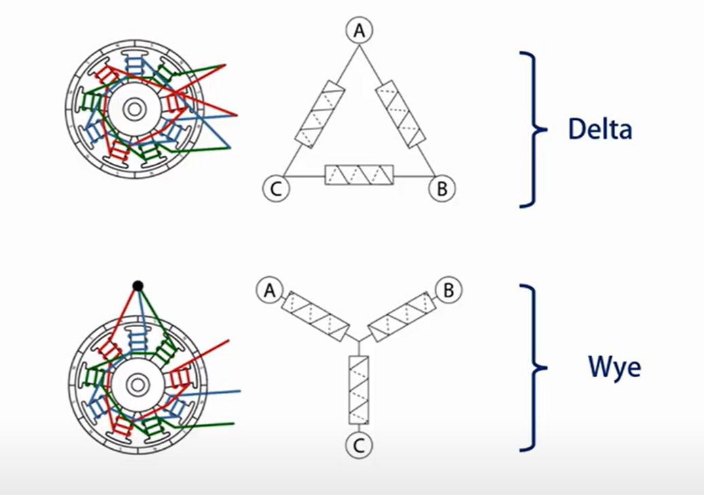
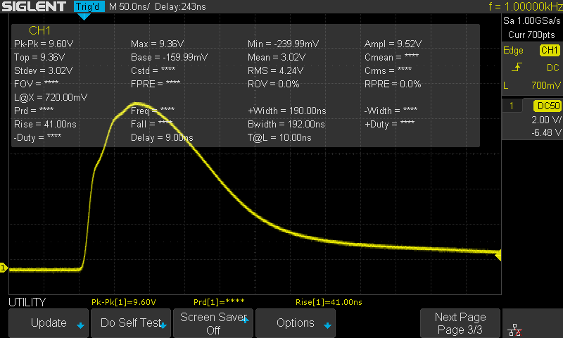
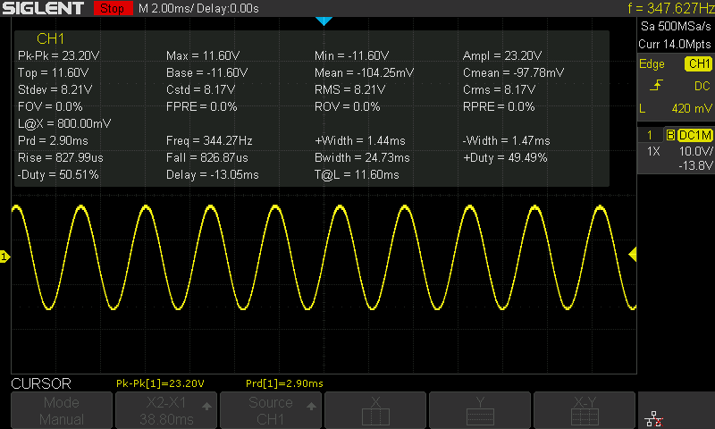
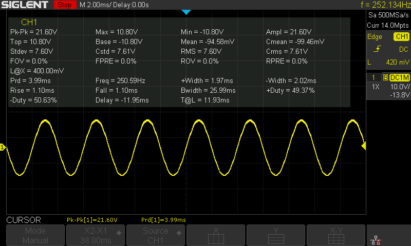
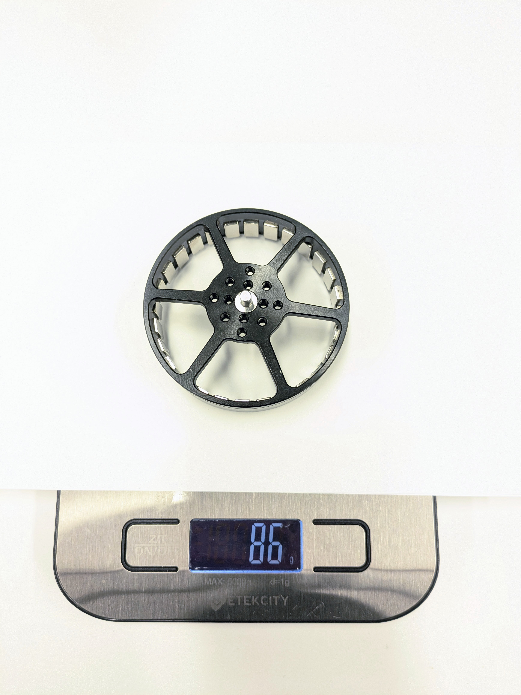
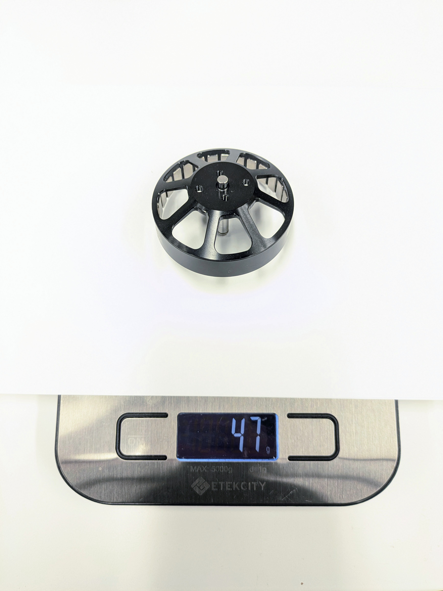
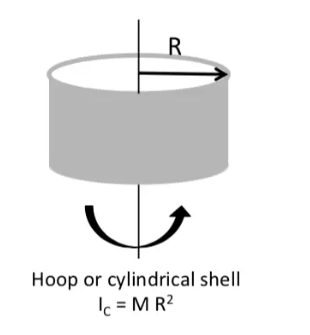

# Motor Characterization

The overall actuator performance depends on several characteristics of the motor, including the winding type, phase resistance, phase inductance, and more. To achieve a smaller sim-to-real gap, we need to identify the actual value of these motor parameters.

In this note, we characterize the MAD Components M6C12 and 5010 motor that are used in the robot actuators.

## Phase Winding Type

<figure><figcaption></figcaption></figure>

For BLDC motors, there are two possible winding types, delta winding and wye winding. The line-to-line measurement that we are going to do in the following sections have different implications for different motor winding types, so we need to determine the winding type of our motor first.

To identify the phase connection, we energize two phase wires with power supply set to 1.00 V and current limit to 10.0 A. The winding type can be determined by observing the thermal image of the winding.

When two phase wires are energized, only one-third of the windings are heated. Hence, both motors are using delta winding.

### M6C12 Motor = Delta Winding

<figure><figcaption><p>Phase wire A-B energized</p></figcaption></figure>

<figure><figcaption><p>Phase wire B-C energized</p></figcaption></figure>

### 5010 Motor = Delta Winding

<figure><figcaption><p>Phase wire A-B energized</p></figcaption></figure>

<figure><figcaption><p>Phase wire B-C energized</p></figcaption></figure>

## Phase Resistance

The phase resistance can be calculated from the line-to-line resistance with the following relation:

$$
R\_{wye} = \frac{1}{2}R\_{ll}

\qquad\qquad\qquad

R\_{delta} = \frac{3}{2}R\_{ll}
$$

To measure line-to-line resistance, we energize phases with a constant voltage and measure the current flowing through the winding.

### M6C12 Motor = 0.1886 R

The power supply is set to be 0.99 V.

Phase wire A-B energized, measured current 7.872 A.

Phase wire B-C energized, measured current 7.879 A.

The line-to-line resistance is calucated to be

$$
R\_{ll} = \frac{V\_{ll}}{I\_{ll}} = Avg(\frac{0.99\~\text{V}}{7.872\~\text{A}}, \frac{0.99\~\text{V}}{7.879\~\text{A}}) \approx 0.1257\~\Omega
$$

The phase resistance can then be caluclated as

$$
R\_q = \frac{3}{2}R\_{ll} = \frac{3}{2} \times 0.1257\~\Omega = 0.1886\~\Omega
$$

The phase resistance of the M6C12 motor is 0.1886 Ω.

### 5010 Motor = 0.6193 R

The power supply is set to be 1.00 V.

Phase wire A-B energized, measured current 2.468 A

Phase wire A-B energized, measured current 2.378 A

The line-to-line resistance is calucated to be

$$
R\_{ll} = \frac{V\_{ll}}{I\_{ll}} = Avg(\frac{1.00\~\text{V}}{2.468\~\text{A}}, \frac{1.00\~\text{V}}{2.378\~\text{A}}) \approx 0.4129\~\Omega
$$

The phase resistance can then be caluclated as

$$
R\_q = \frac{3}{2}R\_{ll} = \frac{3}{2} \times 0.4129\~\Omega = 0.6193\~\Omega
$$

The phase resistance of the M6C12 motor is 0.6193 Ω.

## Phase Inductance

The phase inductance can be calculated from the line-to-line inductance with the following relation:

$$
L\_{wye} = \frac{3}{2}L\_{ll}

\qquad\qquad\qquad

L\_{delta} = \frac{1}{2}L\_{ll}
$$

We use a digital LCR tester to measure the inducance of the winding.

### M6C12 Motor = 0.0325 mH

Between phase wire A-B: 0.065 mH

Between phase wire A-C: 0.065 mH

Between phase wire B-C: 0.065 mH

The average line-to-line inductance is hence

$$
L\_{ll} = 6.50e^{-5}\~\text{H}
$$

The phase inductance can then be caluclated as

$$
L\_q = \frac{1}{2}R\_{ll} = \frac{1}{2} \times 6.50e^{-5}~~\text{H} = 3.25e^{-5}~~\text{H}
$$

The phase resistance of the M6C12 motor is 0.0325 mH.

### 5010 Motor = 0.0850 mH

Between phase wire A-B: 0.170 mH

Between phase wire A-C: 0.168 mH

Between phase wire B-C: 0.172 mH

The average line-to-line inductance is hence

$$
L\_{ll} = 1.70e^{-4}\~\text{H}
$$

The phase inductance can then be caluclated as

$$
L\_q = \frac{1}{2}R\_{ll} = \frac{1}{2} \times 1.70e^{-4}~~\text{H} = 8.50e^{-5}~~\text{H}
$$

The phase resistance of the M6C12 motor is 0.0850 mH.

<details>

<summary>Alternative Approach</summary>

An alternative approach to measure the phase inductance is to supply a square wave to the motor phase winding, and measure the voltage change. However, we couldn't interpret the result correctly.


Testbench setup



Rise time of the M6C12 between phase A and B

</details>

## Motor Back EMF Constant

$$
V\_{ll,wye} = \sqrt{2}V\_{q} = \sqrt{2}k\_{emf}\frac{d\theta\_m}{dt}

\qquad\qquad\qquad

V\_{ll,delta} = \sqrt{\frac{2}{3}}V\_{q} = \sqrt{\frac{2}{3}}k\_{emf}\frac{d\theta\_m}{dt}
$$

$$
\tau = k\_{emf}I\_q = \sqrt{\frac{3}{2}}\frac{1}{k\_{emf}}I\_q
$$

[reference](https://www.radiocontrolinfo.com/about-rc-brushless-motor-windings/)

[reference](https://www.youtube.com/watch?v=jrWDBkeOVQY\&t=901s)

To test the BEMF value, the motor under test is driven with a electrical drill with a constant velocity. The voltage is measured between two phase wires.

### M6C12 Motor = 0.0919 Nm / A

<figure><figcaption></figcaption></figure>

From the oscilloscope reading, we get electrical rotation frequency to be 344.27 Hz, and peak-to-peak line-to-line voltage to be 23.20 V.

Calculate electrical rotation velocity

$$
\omega\_\text{elec} = 2 \pi f\_\text{elec} = 2\pi \times 344.27\~\text{Hz}= 2163.11\~\text{rad/s}
$$

Calculate mechanical rotation velocity

$$
\omega\_\text{mech} = \frac{\omega\_\text{elec}}{N\_\text{pole-pair}} = \frac{2163.11\~\text{rad/s}}{14} = 154.51\~\text{rad/s}
$$

As a sanity check, we can first calculate the measured KV value

$$
K\_V = \frac{\omega\_\text{mech}}{\frac{1}{2}V\_\text{pk-pk}} = \frac{154.51\~\text{rad/s}}{0.5 \times 23.20\~\text{V}} = 13.320\~\text{rad/Vs} = 127.19\~\text{RPM/V}
$$

This result roughly matches the label on the motor, which is 150 KV.

To calculate the torque constant, we have

$$
\begin{aligned}
K\_\tau
&= \sqrt\frac{3}{2} \frac{\frac{1}{2}V\_\text{pk-pk}}{\omega\_\text{mech}} \\
&= \sqrt\frac{3}{2} \frac{\frac{1}{2} \times 23.20\~\text{V}}{154.51\~\text{rad/s}} \\
&= 0.0919\~\text{Vs/rad} \\
&= 0.0919\~\text{Nm / A}
\end{aligned}
$$

Thus, the torque constant of the M6C12 motor is 0.0919 Nm / A

### 5010 Motor = 0.1176 Nm / A

<figure><figcaption></figcaption></figure>

From the oscilloscope reading, we get electrical rotation frequency to be 250.59 Hz, and peak-to-peak line-to-line voltage to be 21.60 V.

Calculate electrical rotation velocity

$$
\omega\_\text{elec} = 2 \pi f\_\text{elec} = 2\pi \times 250.59\~\text{Hz}= 1574.50\~\text{rad/s}
$$

Calculate mechanical rotation velocity

$$
\omega\_\text{mech} = \frac{\omega\_\text{elec}}{N\_\text{pole-pair}} = \frac{1574.50\~\text{rad/s}}{14} = 112.465\~\text{rad/s}
$$

As a sanity check, we can first calculate the measured KV value

$$
K\_V = \frac{\omega\_\text{mech}}{\frac{1}{2}V\_\text{pk-pk}} = \frac{112.465\~\text{rad/s}}{0.5 \times 21.60\~\text{V}} = 10.413\~\text{rad/Vs} = 99.44\~\text{RPM/V}
$$

This result roughly matches the label on the motor, which is 110 KV.

To calculate the torque constant, we have

$$
\begin{aligned}
K\_\tau
&= \sqrt\frac{3}{2} \frac{\frac{1}{2}V\_\text{pk-pk}}{\omega\_\text{mech}} \\
&= \sqrt\frac{3}{2} \frac{\frac{1}{2} \times 21.60\~\text{V}}{112.465\~\text{rad/s}} \\
&= 0.1176\~\text{Vs/rad} \\
&= 0.1176\~\text{Nm / A}
\end{aligned}
$$

Thus, the torque constant of the 5010 motor is 0.1176 Nm / A

## Motor Rotor Inertia

<figure><figcaption></figcaption></figure>

<figure><figcaption></figcaption></figure>

The rotor can be approximated as a cylindrical shell.

<figure><figcaption></figcaption></figure>

The diameter of the rotors are 68 mm for M6C12, and 53 mm for 5010.

$$
I\_{M6C12} = M R^2 = 0.086\~\text{kg} \times (0.5 \times 0.068\~\text{m})^2 = 9.942e^{-05}\~\text{kg}\cdot\text{m}^2
$$

$$
I\_{5010} = M R^2 = 0.047\~\text{kg} \times (0.5 \times 0.053\~\text{m})^2 = 3.301e^{-05}\~\text{kg}\cdot\text{m}^2
$$

The final reflected inertia is magnified by the gearbox, which we would mutiply by the **reduction ratio squared**. The final results are

$$
I\_{M6C12} = 9.942e^{-05}\~\text{kg}\cdot\text{m}^2 \times 15^2 = 0.0224 \~\text{kg}\cdot\text{m}^2
$$

$$
I\_{5010} = 3.301e^{-05}\~\text{kg}\cdot\text{m}^2 \times 15^2 = 0.00743 \~\text{kg}\cdot\text{m}^2
$$

## Summary

As a result, we summarize the motor characteristics in the following table

<table data-full-width="false"><thead><tr><th>Motor Name</th><th>Phase Resistance (Ω)</th><th>Phase Inductance (mH)</th><th>Motor BEMF (Nm / A)</th><th>Motor Rotor Inertia (kg · m²)</th></tr></thead><tbody><tr><td>M6C12 150KV</td><td>0.1886</td><td>0.0325</td><td>0.0919</td><td>0.0224</td></tr><tr><td>5010 110KV</td><td>0.6193</td><td>0.0850</td><td>0.1176</td><td>0.00743</td></tr><tr><td>5010 140KV</td><td>0.3939</td><td>0.0433</td><td>0.0913</td><td>0.00743</td></tr><tr><td>5010 310KV</td><td>0.1462</td><td>0.0023</td><td>0.0298</td><td>0.00743</td></tr></tbody></table>


---

# Agent Instructions: Querying This Documentation

If you need additional information that is not directly available in this page, you can query the documentation dynamically by asking a question.

Perform an HTTP GET request on the current page URL with the `ask` query parameter:

```
GET https://berkeley-humanoid-lite.gitbook.io/docs/in-depth-contents/motor-characterization.md?ask=<question>
```

The question should be specific, self-contained, and written in natural language.
The response will contain a direct answer to the question and relevant excerpts and sources from the documentation.

Use this mechanism when the answer is not explicitly present in the current page, you need clarification or additional context, or you want to retrieve related documentation sections.
