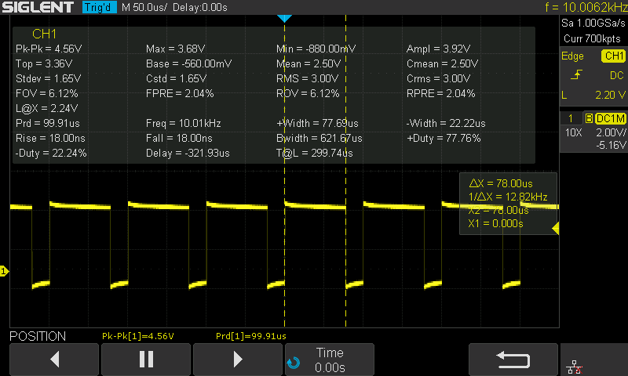
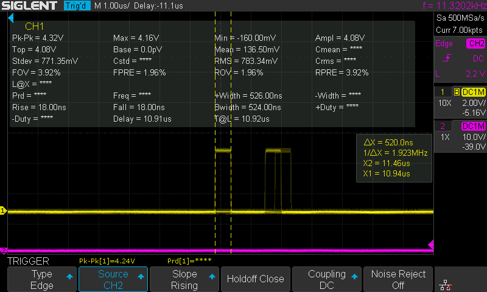
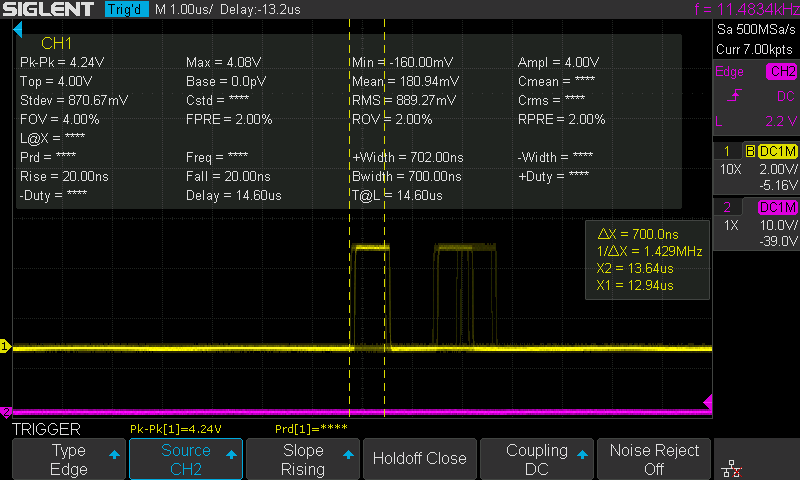
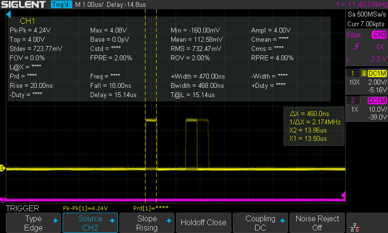
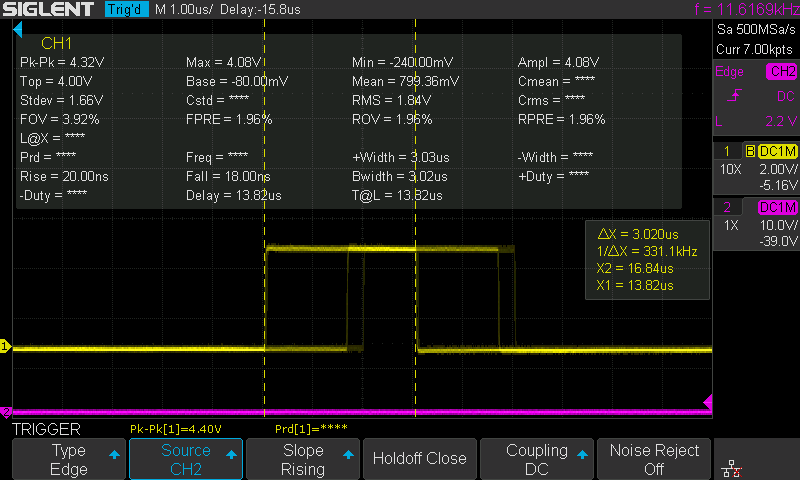

# Motor Controller Firmware Execution Timing Information

The high dynamic nature of the motor drive circuit imposes a strict requirement on the realtimeness of the firmware. We must ensure that we can run everything within a single FOC commutation loop.

We performed several measurements on the Recoil firmware code running on the motor controller to profile the execution time.

The timing information is measured with a Siglent SDS 1202X-E oscilloscope via a GPIO header on the motor controller board.

The system clock is configured as 160 MHz. The compiler optimization is set to `-O2`.

## Current Control

Entire loop

### Encoder reading

<figure><figcaption></figcaption></figure>

The delta time between issuing **HAL\_I2C\_Master\_Receive\_IT** and receiving the interrupt is 78 us.

Hence, the maximum frequency it can run at is 12 kHz.

### Clarke transform

<figure><figcaption></figcaption></figure>

### Park transform

<figure><figcaption></figcaption></figure>

### V\_D V\_Q target calculation

<figure><figcaption></figcaption></figure>

### Overmodulation

<figure><figcaption></figcaption></figure>

### Inverse park transformation

<figure><figcaption></figcaption></figure>

### SVPWM

<figure><figcaption></figcaption></figure>


---

# Agent Instructions: Querying This Documentation

If you need additional information that is not directly available in this page, you can query the documentation dynamically by asking a question.

Perform an HTTP GET request on the current page URL with the `ask` query parameter:

```
GET https://berkeley-humanoid-lite.gitbook.io/docs/in-depth-contents/motor-controller-firmware-execution-timing-information.md?ask=<question>
```

The question should be specific, self-contained, and written in natural language.
The response will contain a direct answer to the question and relevant excerpts and sources from the documentation.

Use this mechanism when the answer is not explicitly present in the current page, you need clarification or additional context, or you want to retrieve related documentation sections.
